# Architecture Diagrams - Budget Buddy

**Course**: COMP6905 — Software Engineering  
**Project**: Budget Buddy  
**Team**: Group 6  
**Date**: November 26, 2025  
**Purpose**: Overall system architecture and 4+1 architectural view model  
**Status**: ✅ Complete — All diagrams documented

This document provides comprehensive architecture documentation following the 4+1 architectural view model, including UML diagrams, component interactions, and deployment architecture.

> 📋 **Related Documents**:  
> - [`Documents/Requirements.md`](Documents/Requirements.md) - Functional and non-functional requirements  
> - [`Documents/Acceptance_Tests.md`](Documents/Acceptance_Tests.md) - Requirements traceability and test coverage  
> - [`Documents/Planning_Mapping.md`](Documents/Planning_Mapping.md) - Issue mapping and team contributions  
> - [`Documents/UML/`](Documents/UML/) - All UML diagram source files  

---

## Table of Contents

1. [Overall System Architecture](#1-overall-system-architecture)
2. [4+1 Architectural View Model](#2-41-architectural-view-model)
   - [2.1 Logical View](#21-logical-view)
   - [2.2 Process View](#22-process-view)
   - [2.3 Development View](#23-development-view)
   - [2.4 Physical View](#24-physical-view)
   - [2.5 Scenarios (Use Case View)](#25-scenarios-use-case-view)
3. [UML Diagrams Reference](#3-uml-diagrams-reference)
4. [Summary & Key Decisions](#4-summary--key-decisions)

---

## 1. Overall System Architecture

### 1.1 High-Level Architecture Diagram

Budget Buddy follows a **Client-Server Architecture** with **Layered Architecture** within the client application:

**Primary Architecture Pattern: Client-Server**
- **Client**: React running in the browser
- **Server**: Firebase cloud services (Authentication, Firestore Database)

**Secondary Architecture Pattern: Layered Architecture (within Client)**
- **Presentation Layer**: React components, pages, UI elements
- **Business Logic Layer**: Services, utilities, validation, context
- **Data Access Layer**: Firebase SDK integration, API calls

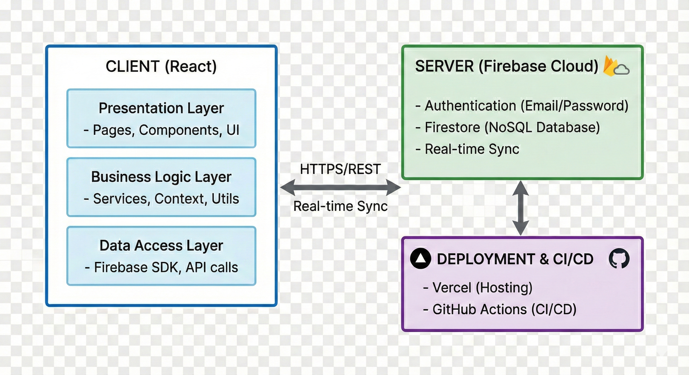

**Architecture Pattern Justification**:
- **Client-Server**: Clear separation between client (React) and server (Firebase), enabling scalability, security, and independent deployment
- **Layered Architecture (Client)**: Separation of concerns within the client application promotes maintainability, testability, and code organization

### Detailed Flowchart of System Architecture Overview
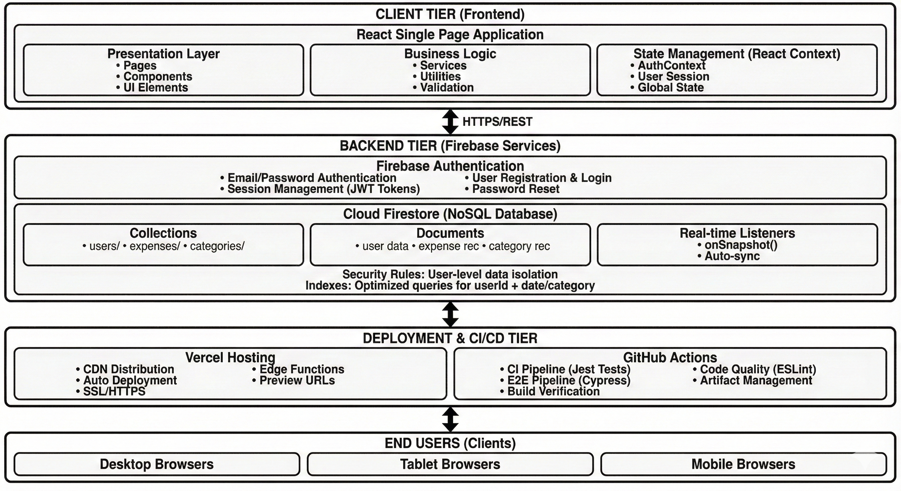


### 1.2 Technology Stack

```
┌─────────────────────────────────────────────────────────────┐
│                    Technology Stack                          │
├─────────────────────────────────────────────────────────────┤
│                                                              │
│  Frontend Layer                                              │
│  ├─ React 18.2.0        (UI Framework)                      │
│  ├─ React Router 6.8.0  (Client-side Routing)               │
│  ├─ React Context API   (State Management)                  │
│  ├─ Chart.js 4.5.0      (Data Visualization)                │
│  ├─ date-fns            (Date Utilities)                    │
│  ├─ react-icons (Lucide)(Icon Library)                      │
│  └─ CSS3                (Styling)                           │
│                                                              │
│  AI Integration                                              │
│  └─ Google Gemini API   (Natural Language Processing)       │
│                                                              │
│  Backend Services (Firebase)                                 │
│  ├─ Firebase Auth       (Authentication)                    │
│  ├─ Cloud Firestore     (NoSQL Database)                    │
│  └─ Firebase SDK 11.10  (Client Library)                    │
│                                                              │
│  Testing & Quality                                           │
│  ├─ Jest + RTL          (Unit Testing)                       │
│  ├─ Cypress 15.6.0      (E2E Testing)                       │
│  └─ ESLint 8.57.1       (Code Quality)                      │
│                                                              │
│  CI/CD & Deployment                                          │
│  ├─ GitHub Actions      (CI/CD Pipeline)                    │
│  └─ Vercel              (Hosting & CDN)                     │
│                                                              │
└─────────────────────────────────────────────────────────────┘
```

---

## 2. 4+1 Architectural View Model

The 4+1 architectural view model describes the architecture using five concurrent views:

1. **Logical View** - Functionality provided to end users (static structure)
2. **Process View** - Dynamic aspects (concurrency, synchronization)
3. **Development View** - Programmer's perspective (software management)
4. **Physical View** - System deployment (network, servers)
5. **Scenarios (Use Case View)** - Ties all views together (user interactions)

---

## 2.1 Logical View

**Purpose**: Shows the key abstractions in the system as objects or object classes.

### 2.1.1 Class Diagram

The Class Diagram shows the core domain model with all classes, attributes, methods, and relationships.

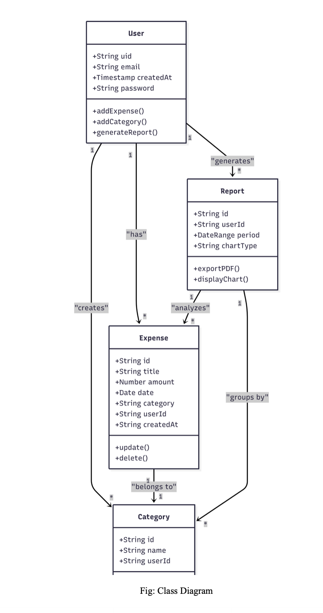

**Key Domain Entities**:
- **User**: Authentication and user management
- **Expense**: Core expense records with CRUD operations
- **Category**: Expense categorization
- **CategoryStats**: Calculated statistics
- **Report**: Report generation and export

**Detailed Relationships**: See [Class Diagram Relationships](UML/Class_Diagram_Relationships.png)

### 2.1.2 Component Architecture

```
┌─────────────────────────────────────────────────────────────────┐
│                      Budget Buddy System                         │
│                                                                  │
│  ┌────────────────────────────────────────────────────────┐    │
│  │           Presentation Layer                            │    │
│  │  ┌──────────┐  ┌──────────┐  ┌──────────────────────┐ │    │
│  │  │  Auth    │  │Dashboard │  │   Expense Mgmt       │ │    │
│  │  │  Pages   │  │  Pages   │  │   Components         │ │    │
│  │  │          │  │          │  │                      │ │    │
│  │  │ • Login  │  │ • Overview│  │ • ExpenseForm       │ │    │
│  │  │ • Signup │  │ • Reports│  │ • ExpenseList       │ │    │
│  │  └──────────┘  └──────────┘  └──────────────────────┘ │    │
│  │         ↓              ↓                ↓              │    │
│  └─────────┼──────────────┼────────────────┼──────────────┘    │
│            │              │                │                    │
│            ↓              ↓                ↓                    │
│  ┌────────────────────────────────────────────────────────┐    │
│  │              Business Logic Layer                       │    │
│  │  ┌──────────────┐  ┌──────────────┐  ┌─────────────┐  │    │
│  │  │   Contexts   │  │   Services   │  │  Utilities  │  │    │
│  │  │              │  │              │  │             │  │    │
│  │  │ • AuthContext│  │ • expenseService.js│ │ • Validators│  │    │
│  │  │ • DateRange  │  │ • categoryService.js│ │ • Formatters│  │    │
│  │  │   Context    │  │ • settingsService.js│ │ • Helpers   │  │    │
│  │  │              │  │ • aiService.js │  │             │  │    │
│  │  └──────────────┘  └──────────────┘  └─────────────┘  │    │
│  │         ↓                   ↓                          │    │
│  └─────────┼───────────────────┼──────────────────────────┘    │
│            │                   │                                │
│            ↓                   ↓                                │
│  ┌────────────────────────────────────────────────────────┐    │
│  │              Data Access Layer                          │    │
│  │  ┌──────────────────┐  ┌──────────────────────────┐   │    │
│  │  │ Firebase Auth    │  │  Cloud Firestore         │   │    │
│  │  │                  │  │                          │   │    │
│  │  │ • Authentication │  │ • CRUD Operations        │   │    │
│  │  │ • Session Mgmt   │  │ • Real-time Listeners    │   │    │
│  │  │ • JWT Tokens     │  │ • Query Execution        │   │    │
│  │  └──────────────────┘  └──────────────────────────┘   │    │
│  └────────────────────────────────────────────────────────┘    │
└─────────────────────────────────────────────────────────────────┘
```

### 2.1.3 Firestore Database Structure

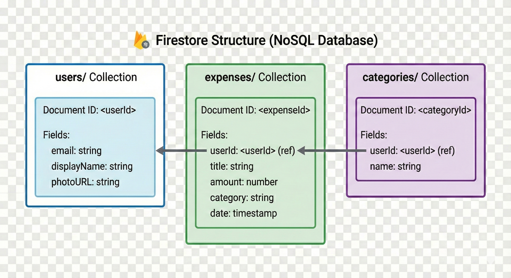

The Firestore Structure diagram illustrates the NoSQL database schema used in Budget Buddy, showing the three main collections and their relationships.

**Structure**: All user data lives under a single top-level `users/` document, using **subcollections** for data isolation.

```
users/
└── {userId}/
    ├── expenses/
    │   └── {expenseId}/
    │       ├── title:    string
    │       ├── amount:   number
    │       ├── category: string
    │       └── date:     string (YYYY-MM-DD)
    ├── categories/
    │   └── {categoryId}/
    │       └── name: string
    └── settings/
        └── preferences/
            └── defaultDateFilter: string  (e.g. "thisMonth", "lastMonth")
```

**Subcollections**:

1. **`users/{userId}/expenses/`**
   - One document per expense record
   - Fields: `title`, `amount`, `category`, `date`
   - Accessed via `addExpense`, `updateExpense`, `deleteExpense`, `subscribeToExpenses`, `subscribeToExpensesByCategory`

2. **`users/{userId}/categories/`**
   - One document per user-defined category
   - Fields: `name`
   - Accessed via `addCategory`, `updateCategory`, `deleteCategory`, `subscribeToCategories`

3. **`users/{userId}/settings/preferences`**
   - Single document storing persisted user preferences
   - Fields: `defaultDateFilter`
   - Accessed via `getUserSettings`, `saveUserSettings` (used by the Settings page and `DateRangeContext`)

**Key Design Principles**:
- **User Isolation**: Subcollection paths include `userId` — no cross-user queries are possible, and Firestore Security Rules enforce authenticated-only access
- **NoSQL Structure**: Flexible schema allows extension without migrations
- **Real-time Capabilities**: `onSnapshot()` listeners on expenses and categories subcollections provide instant UI updates
- **Scalability**: Document-based structure supports horizontal scaling and efficient querying

---

## 2.2 Process View

**Purpose**: Shows the dynamic aspects of the system, processes, and how they communicate.

### 2.2.1 State Diagram - Expense Management

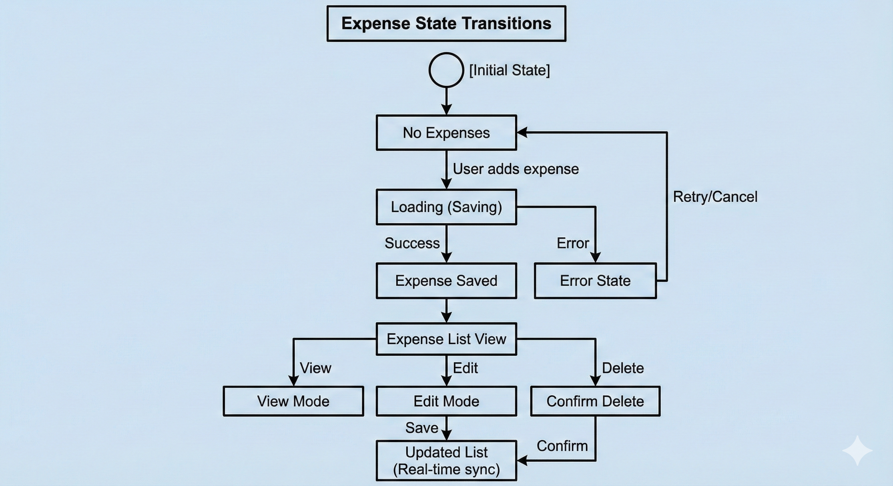

### 2.2.2 Sequence Diagrams

Sequence diagrams illustrate the dynamic interactions between system components for various user operations. All sequence diagrams are located in [`Documents/UML/`](Documents/UML/):

| Operation | Diagram | Description |
|-----------|---------|-------------|
| **Sign Up** | 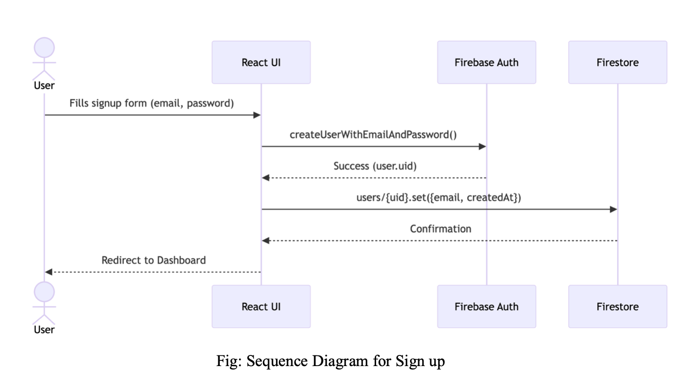 | User registration flow from form submission to account creation |
| **Log In** | 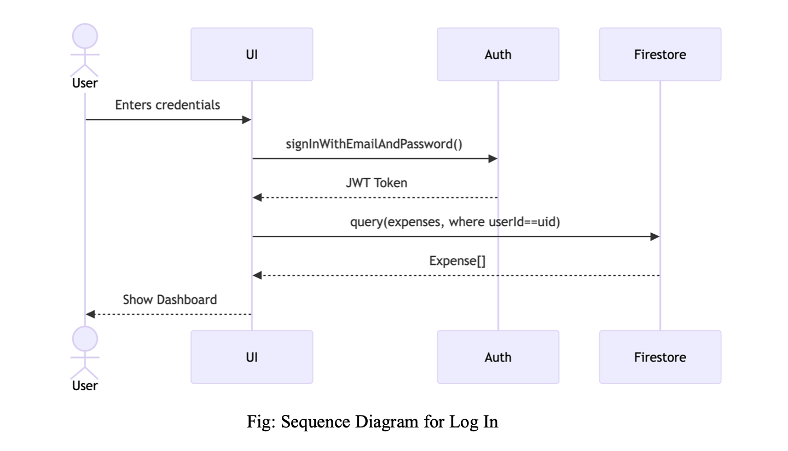 | Authentication process and session management |
| **Log Out** | 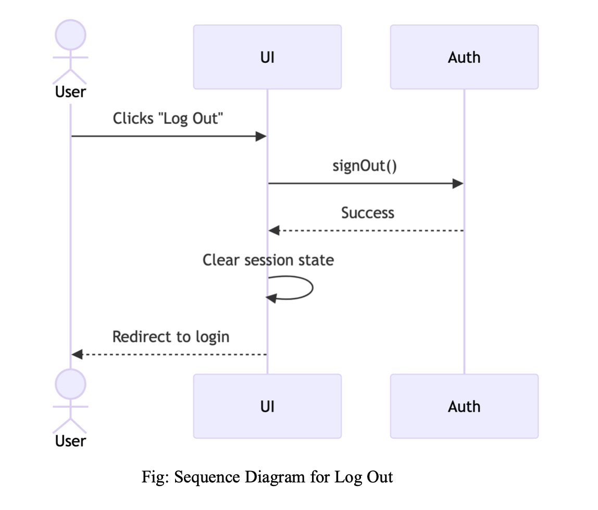 | Logout process and session cleanup |
| **Add Expense** | 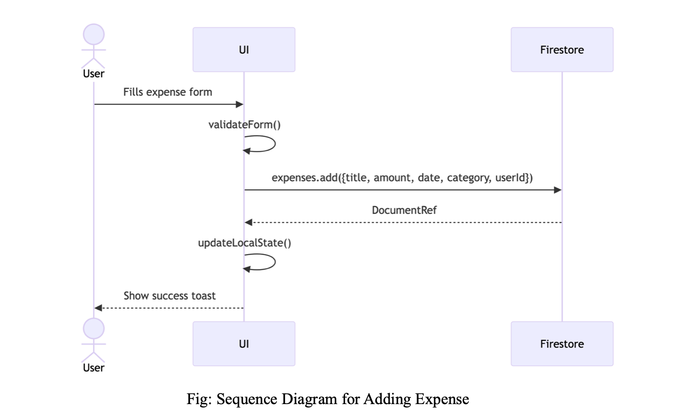 | Adding new expense with validation and real-time sync |
| **Edit Expense** | 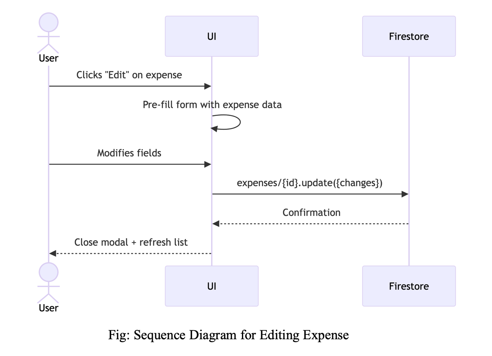 | Editing existing expense workflow |
| **Delete Expense** | 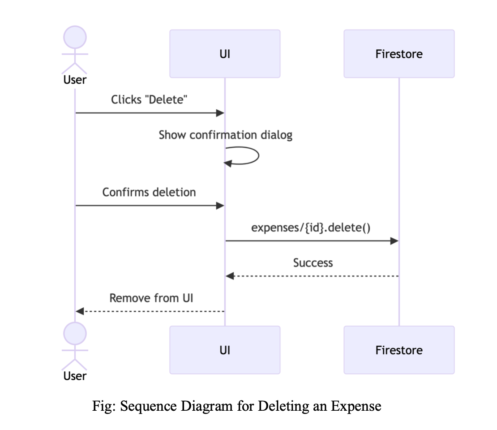 | Expense deletion with confirmation |
| **Add Category** | 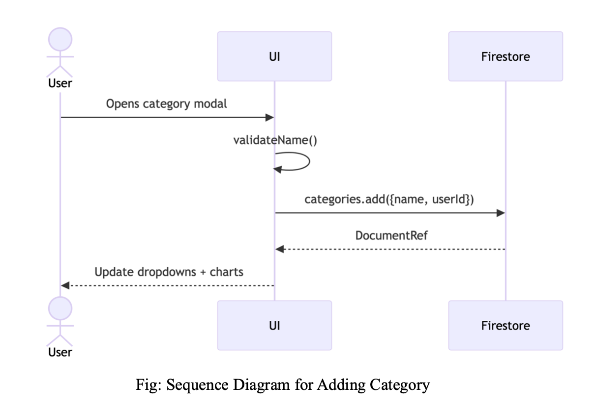 | Creating new expense category |
| **View Dashboard** | 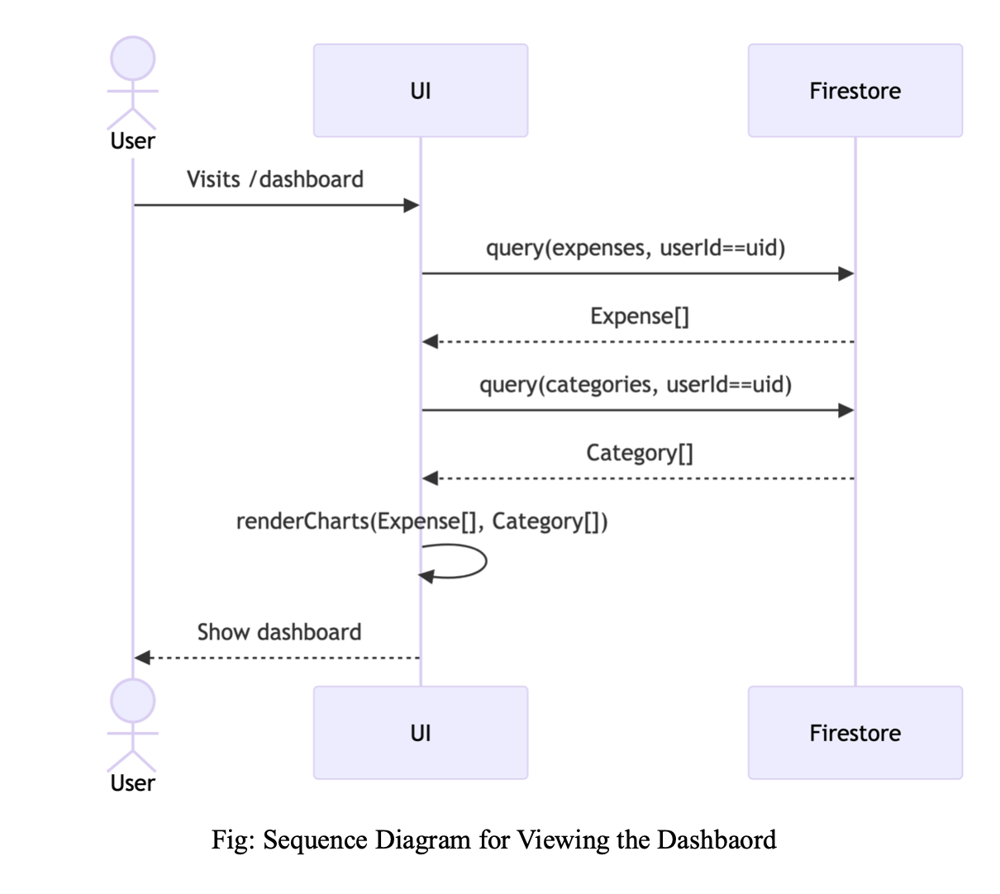 | Dashboard initialization and data loading |
| **Export PDF** | 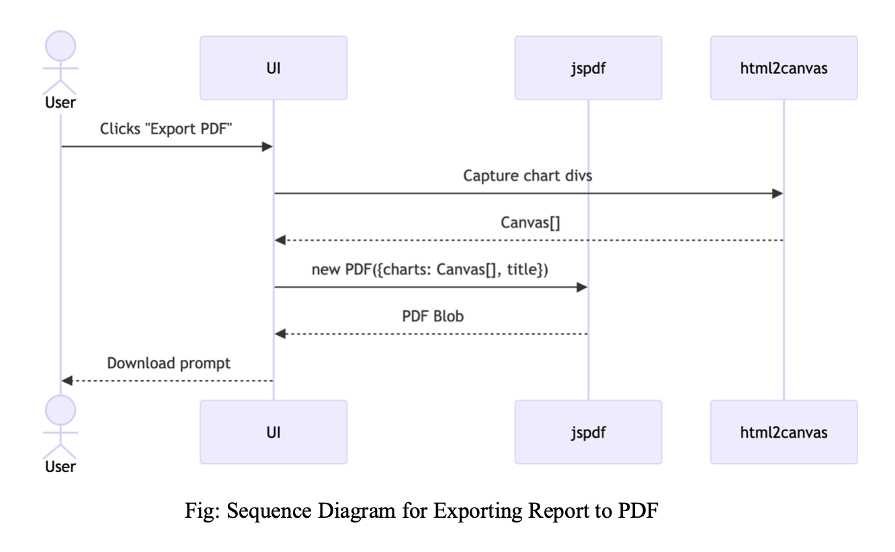 | PDF report generation and export |
| **Filter Charts** | 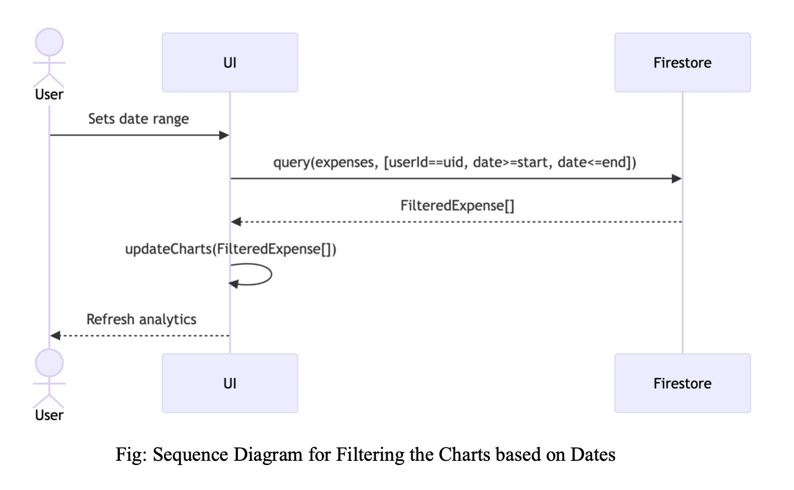 | Date-based filtering for charts and reports |

### 2.2.3 Real-time Data Synchronization Flow

```
Component Mount → useEffect() → Check currentUser → Create Firestore Query
    ↓
Setup onSnapshot Listener
    ↓
┌─────────────────────┬─────────────────────┐
│ Initial Data        │ Data Changes        │
│ Received            │ (Add/Edit/Delete)   │
└─────────────────────┴─────────────────────┘
    ↓
Process Snapshot → Update State → Re-render UI
    ↓
Component Unmount → Cleanup Listener (unsubscribe)
```

**Key Mechanism**: Firestore `onSnapshot()` listeners provide real-time updates. When data changes in Firestore, all active listeners receive updates automatically, triggering React state updates and UI re-renders.

---

## 2.3 Development View

**Purpose**: Describes the system from a programmer's perspective (software management).

### 2.3.1 Package Diagram

.png)

The Package Diagram illustrates the high-level architecture and dependencies of the application's source code, showing the layered structure from components to external Firebase SDK.

**Key Layers**:
- **Components Layer**: React frontend components (Auth, Dashboard, Expense, Charts, Layout, UI, AI)
- **Context Layer**: Global state management — `AuthContext` (authentication) and `DateRangeContext` (shared date filter across all dashboard views)
- **Services Layer**: Data access and AI — `expenseService.js`, `categoryService.js`, `settingsService.js` (Firestore CRUD, split by domain) and `aiService.js` (Gemini API). There is no single `database.js`.
- **External Layer**: Firebase SDK (firebase/auth, firebase/firestore) and Google Gemini REST API

**Dependency Flow**: Components → Hooks → Context → Services → Firebase SDK

**Custom Hooks** (business logic layer, sits between components and services):

| Hook | Purpose |
|------|---------|
| `useAIChat.js` | All AI chat state and event handling; consumes `aiService.js`, `expenseService.js`, `categoryService.js` |
| `useDateFilter.js` | Date-based expense filtering; accepts optional `external` param to bind to `DateRangeContext` |
| `useCategoryData.js` | Aggregates filtered expenses into Chart.js-ready category data; seeds deleted categories as 0 |
| `useReportData.js` | Aggregates filtered expenses into report statistics: totals, averages, monthly trend, top category, spending insights |
| `useSidebar.js` | Sidebar open/close state, mobile drag-to-open gesture, edge-swipe indicator, and overlay click handling |
| `useReportExport.js` | CSV export, PDF generation (jsPDF), AI summary fetch (`generateSummary`), and export dropdown state for the Reports page |
| `useCategoryActions.js` | Add/delete category logic for the Categories page; wraps `categoryService.js` calls with toast feedback and pending-delete confirmation |
| `useAuthForm.js` | Shared form state (`error`, `message`, `loading`) reused across Login, Signup, ForgotPassword, and ResetPassword |

### 2.3.2 Component Organization

```
budget-buddy/
├── src/
│   ├── components/
│   │   ├── AI/            # AIChat.jsx, AIChat.css — floating Gemini chat widget
│   │   ├── Auth/          # Login, Signup, ForgotPassword, ResetPassword
│   │   ├── Dashboard/     # DashboardOverview, Expenses, Categories, Reports, Settings
│   │   ├── Expense/       # ExpenseForm
│   │   ├── Charts/        # PieChart, BarChart, LineChart
│   │   ├── Layout/        # Navbar, Sidebar, Navigation
│   │   └── UI/            # Modal, Toast, Pagination, DateFilterBar,
│   │                      #   ConfirmDialog, BudgetBuddyLogo, ExpenseTable,
│   │                      #   CuteEmptyFace
│   ├── context/           # AuthContext.js, DateRangeContext.js
│   ├── hooks/             # useDateFilter.js, useAIChat.js, useCategoryData.js,
│   │                      #   useReportData.js, useSidebar.js, useReportExport.js,
│   │                      #   useCategoryActions.js, useAuthForm.js
│   ├── services/          # expenseService.js, categoryService.js,
│   │                      #   settingsService.js, aiService.js
│   ├── styles/            # main.css, tokens.css, modal.css, modal-forms.css,
│   │                      #   confirm-dialog.css, styles-landing.css,
│   │                      #   styles-pages.css, styles-settings.css,
│   │                      #   styles-additions.css, styles-overrides.css
│   ├── utils/             # getCategoryIcon.js, getCategoryColor.js,
│   │                      #   formatDate.js, validatePassword.js
│   └── __tests__/         # Unit tests
├── cypress/               # E2E tests
├── .github/workflows/     # CI/CD workflows
└── Documents/             # Project documentation
```

### 2.3.3 Module Dependencies

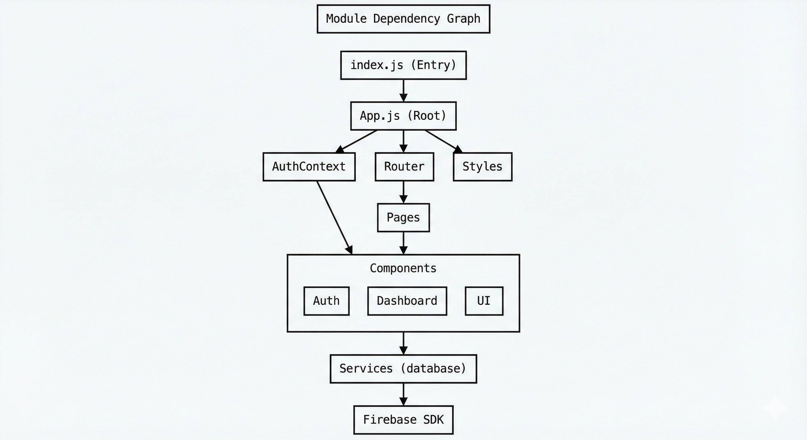

**Dependency Flow**: Components → Context → Services → Firebase SDK

---

## 2.4 Physical View

**Purpose**: Shows the system from a system engineer's perspective (deployment).

### 2.4.1 Deployment Architecture

.png)

### 2.4.2 Deployment Flow

```
Client Devices (Desktop/Tablet/Mobile)
    ↓ HTTPS
Vercel Edge Network (CDN - 100+ locations)
    ↓
Vercel Hosting Platform
    ├─ React Build (Optimized bundles)
    └─ Environment Variables (Firebase config)
    ↓ Firebase SDK
Firebase Cloud Platform
    ├─ Firebase Authentication (Multi-region)
    └─ Cloud Firestore (Multi-region, Auto-scaling)
    ↓
CI/CD Infrastructure (GitHub Actions)
    ├─ CI Pipeline (Jest Tests)
    └─ E2E Pipeline (Cypress Tests)
```

**Key Deployment Characteristics**:
- **Global CDN**: Vercel edge network for fast content delivery
- **Serverless**: No server management required
- **Auto-scaling**: Firebase handles traffic spikes automatically
- **Multi-region**: Firebase services replicated globally
- **Zero-downtime**: Vercel enables instant rollbacks

---

## 2.5 Scenarios (Use Case View)

**Purpose**: Describes the system's functionality as seen by end users.

### 2.5.1 Use Case Diagram

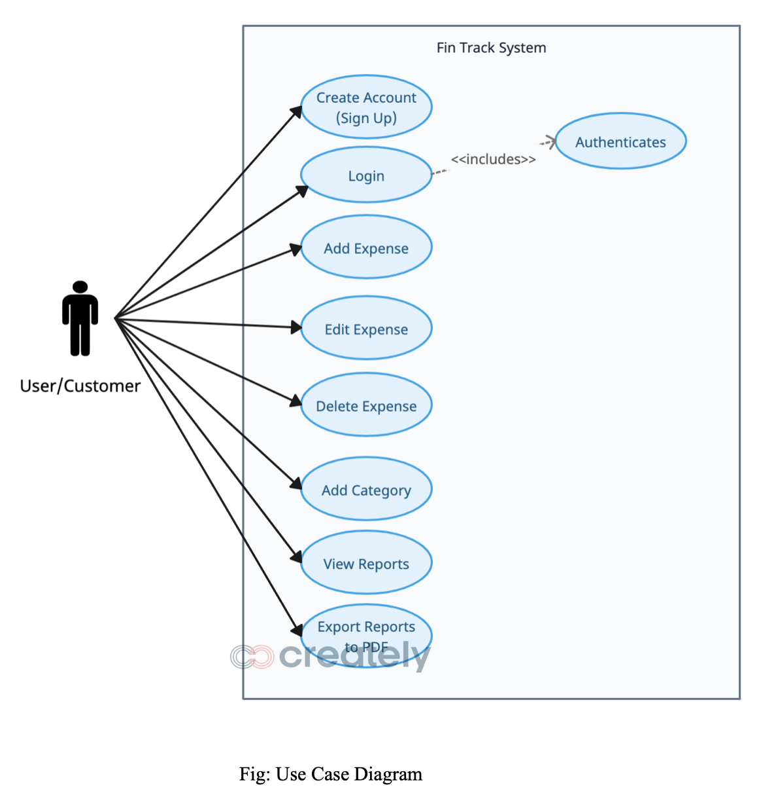

**Actors**:
- **Guest User**: Can sign up, login, view landing page
- **Registered User**: Full access to all features

**Use Cases**:
- **Authentication**: Sign Up (with display name), Login, Logout, Reset Password
- **Expense Management**: Add, Edit, Delete, View, Filter Expenses
- **Category Management**: Create, Delete, View Categories
- **Dashboard & Reports**: View Overview, Charts, Generate PDF, Export CSV, View Statistics
- **AI Chat**: Add/edit/delete expenses and categories via natural language, query spending data, set date range via chat
- **User Settings**: Update display name, send password reset email, save default date-range preference

### 2.5.2 Key Use Case: Add Expense

**Actor**: Authenticated User  
**Preconditions**: User is logged in  
**Postconditions**: Expense is saved to database

**Main Flow**:
1. User navigates to Expenses page
2. User clicks "Add Expense" button
3. System displays expense form modal
4. User enters expense details (Title, Amount, Category, Date)
5. User clicks "Submit"
6. System validates input
7. System saves expense to Firestore
8. Real-time listener updates UI
9. System displays success message
10. System closes modal

**Alternative Flows**:
- **6a. Validation fails**: System displays error message, user corrects input
- **7a. Database error**: System displays error toast, user can retry

---

## 3. UML Diagrams Reference

All UML diagrams are stored in [`Documents/UML/`](Documents/UML/):

| Diagram Type | File Name | Description |
|--------------|-----------|-------------|
| **Use Case** | `Use_Case_Diagram.png` | All actors and use cases |
| **Class Diagram** | `Class_Diagram.png` | Core domain model |
| **Class Relationships** | `Class_Diagram_Relationships.png` | Detailed class relationships |
| **State Diagram** | `State_Diagram_Expense_Management.png` | Expense state transitions |
| **Sequence - Sign Up** | `Sequence_Diagram_for_Sign_up.png` | User registration flow |
| **Sequence - Log In** | `Sequence_Diagram_for_Log_In.png` | Authentication flow |
| **Sequence - Log Out** | `Sequence_Diagram_for_Log_Out.png` | Session cleanup |
| **Sequence - Add Expense** | `Sequence_Diagram_for_Adding_Expense.png` | Adding expense flow |
| **Sequence - Edit Expense** | `Sequence_Diagram_for_Editing_Expense.png` | Editing expense flow |
| **Sequence - Delete Expense** | `Sequence_Diagram_for_Deleting_an_Expense.png` | Deleting expense flow |
| **Sequence - Add Category** | `Sequence_Diagram_for_Adding_Category.png` | Creating category flow |
| **Sequence - View Dashboard** | `Sequence_Diagram_for_Viewing_the_Dashbaord.png` | Dashboard initialization |
| **Sequence - Export PDF** | `Sequence_Diagram_for_Exporting_Report_to_PDF.png` | PDF generation flow |
| **Sequence - Filter Charts** | `Sequence_Diagram_for_Filtering_the_Charts_based_on_Dates.png` | Date filtering flow |
| **Development View** | `Development_View(Package_Diagram).png` | Package structure and dependencies |
| **Module Dependencies** | `Module_Dependency_Graph.png` | Component dependency graph |
| **Physical View** | `Physical_View(Deployment_Diagram).png` | Deployment architecture |
| **System Architecture** | `Detailed_System_Architecture.png` | High-level system architecture |
| **Firestore Structure** | `Firestore_Structure.png` | Database schema |

---

## 4. Summary & Key Decisions

### 4.1 Architectural Patterns

1. **Primary Pattern: Client-Server Architecture**
   - React SPA (client) communicates with Firebase cloud services (server)
   - Clear separation of concerns, scalability, independent deployment

2. **Secondary Pattern: Layered Architecture (within Client)**
   - **Presentation Layer**: React components, pages, UI elements
   - **Business Logic Layer**: Services, utilities, validation, React Context
   - **Data Access Layer**: Firebase SDK integration and API communication
   - Promotes separation of concerns, testability, and maintainability

### 4.2 Key Architectural Decisions

- **Real-time Synchronization**: Firestore `onSnapshot()` listeners for instant data updates
- **Stateless Frontend**: State managed in React Context (`AuthContext`, `DateRangeContext`) and Firestore
- **Serverless Backend**: Firebase handles all backend operations
- **CDN Deployment**: Vercel edge network for global distribution
- **CI/CD Integration**: Automated testing and deployment pipelines
- **Client-side AI Integration**: Google Gemini API called directly from the browser via REST (`aiService.js`). The API key is stored in `.env` (never committed). This avoids backend infrastructure while providing natural-language expense management. **Known risks**: `REACT_APP_*` variables are compiled into the JS bundle and visible in DevTools — anyone can extract the key and make Gemini API calls at your billing cost. The daily 50-request cap is tracked in `localStorage` and is bypassable client-side. For production, proxy the Gemini call through a backend function (Firebase Cloud Function or Vercel serverless) to keep the key server-side and enforce rate limiting against the Firebase Auth UID.
- **User-preference Persistence**: User settings (e.g. default date filter) are persisted to Firestore under `users/{userId}/settings/preferences` and loaded into `DateRangeContext` on login, ensuring consistent UX across sessions.

### 4.3 Architecture Benefits

- ✅ **Scalability**: Firebase auto-scales with user load
- ✅ **Real-time**: Instant data synchronization across devices
- ✅ **Security**: Firestore Security Rules enforce user data isolation server-side — version-controlled in `firestore.rules` at the project root
- ✅ **Performance**: CDN distribution ensures fast load times
- ✅ **Maintainability**: Clear separation of concerns
- ✅ **Testability**: Comprehensive testing at all levels

### 4.4 Technology Justification

For detailed technology choices and alternatives considered, see the [Technologies & Tools section in README.md](../README.md#️-technologies--tools).

**Key Technologies**:
- **React.js**: Component-based architecture, extensive ecosystem
- **Firebase Auth**: Production-ready authentication with minimal setup
- **Cloud Firestore**: Real-time NoSQL database with automatic scaling
- **Vercel**: Zero-config React deployment with global CDN
- **GitHub Actions**: CI/CD integrated with repository

---

**Last Updated**: August 26, 2026  
**Project**: Budget Buddy | Group 6 | Memorial University of Newfoundland

> 📋 **UML Diagrams**: All diagrams are located in [`Documents/UML/`](Documents/UML/)  
> 📋 **Related Documents**: See [`Documents/Requirements.md`](Documents/Requirements.md) and [`Documents/Acceptance_Tests.md`](Documents/Acceptance_Tests.md)
