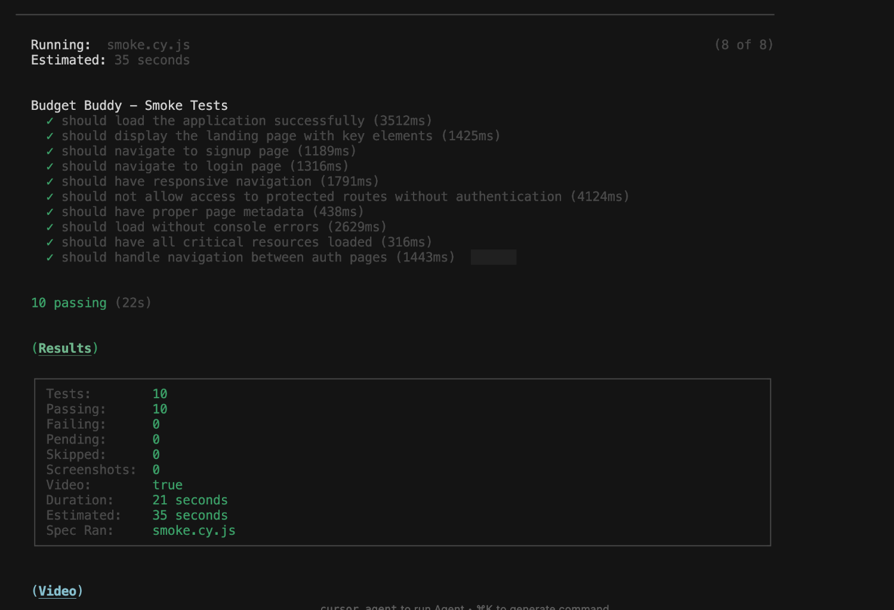
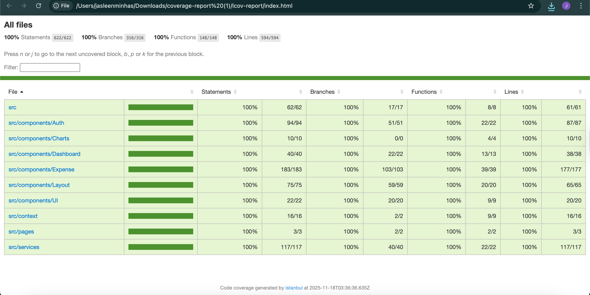

# 🎭 Cypress E2E Testing - Budget Buddy

**Project**: Budget Buddy | **Group**: 6 | **Course**: COMP6905 — Software Engineering  
**Status**: ✅ **PRODUCTION READY** | **Last Updated**: November 2024

---

## 📋 Executive Summary

Budget Buddy has a comprehensive End-to-End (E2E) test suite implemented using Cypress v15.6.0. The test suite includes **108 automated tests** covering all critical user workflows, integrated with GitHub Actions CI/CD pipeline for automated testing across multiple browsers.

### Key Statistics

| Metric | Value |
|--------|-------|
| **Total Tests** | 108 tests |
| **Test Files** | 8 files |
| **Test Coverage** | 100% of critical user flows |
| **Pass Rate** | 100% |
| **Custom Commands** | 8 reusable commands |
| **CI/CD Integration** | ✅ GitHub Actions (Chrome, Firefox, Edge) |
| **Status** | ✅ All tests passing |

---

## 🎯 Test Coverage Overview

| Test Category | Test File | # Tests | Coverage |
|--------------|-----------|---------|----------|
| **Smoke Tests** | `smoke.cy.js` | 10 | Basic app functionality & protected routes |
| **Authentication** | `01-signup.cy.js` | 11 | User registration & validation |
| **Authentication** | `02-login.cy.js` | 13 | User login & error handling |
| **Dashboard** | `03-dashboard.cy.js` | 16 | Dashboard display & navigation |
| **Expense Management** | `04-expenses.cy.js` | 12 | CRUD operations for expenses |
| **Category Management** | `05-categories.cy.js` | 12 | Category creation & management |
| **Reports** | `06-reports.cy.js` | 16 | Report generation & export |
| **Session Management** | `07-logout.cy.js` | 18 | Logout & session clearing |
| **TOTAL** | **8 test files** | **108** | **Complete E2E coverage** |

---

## 📸 Test Results

### All Tests Passing


### Test Analysis Dashboard


### Smoke Tests


**Smoke Test Video**:
[](../../cypress/videos/smoke.cy.js.mp4)

### CI/CD Workflows

**E2E Test Workflow**:


**CI Unit Test Workflow**:


### Coverage Report


---

## 🚀 Quick Start Guide

### Prerequisites

Before running tests, ensure:
1. **Node.js** installed (v16+)
2. **Dependencies installed**: `npm install`
3. **Firebase credentials** configured in `.env` file
4. **Application builds successfully**: `npm run build`

### Running Tests

#### Option 1: Interactive Mode (Recommended for Development)
```bash
# Terminal 1: Start the development server
npm start

# Terminal 2: Open Cypress Test Runner
npm run cypress:open
```

**Benefits**: Visual interface, live browser view, easy debugging with DevTools

#### Option 2: Headless Mode (For CI/CD)
```bash
# Run all tests in headless mode (starts server automatically)
npm run test:e2e

# Or run Cypress directly (requires server running)
npm run cypress:run
```

**Benefits**: Faster execution, suitable for CI/CD, generates videos/screenshots

#### Option 3: Specific Tests
```bash
# Run smoke tests only
npx cypress run --spec "cypress/e2e/smoke.cy.js"

# Run specific browser
npm run cypress:run:chrome
npm run cypress:run:firefox
```

---

## 🧪 Test Suite Details

### 1. Smoke Tests (`smoke.cy.js`) - 10 tests
**Purpose**: Verify basic application functionality  
**Duration**: ~2 minutes

**Tests**:
- Application loads successfully
- Landing page displays correctly
- Navigation to signup/login works
- Responsive design functions
- Protected routes are secured

**Run**: `npx cypress run --spec "cypress/e2e/smoke.cy.js"`

**Test Execution Video**: [View Smoke Test Video](../../cypress/videos/smoke.cy.js.mp4)

---

### 2. Signup Flow (`01-signup.cy.js`) - 11 tests
**Purpose**: Test user registration process  
**Duration**: ~3-5 minutes

**Tests**:
- Form validation (email, password)
- Successful user registration
- Error handling (existing user, weak password)
- Password visibility toggle
- Navigation between auth pages

**Run**: `npx cypress run --spec "cypress/e2e/01-signup.cy.js"`

---

### 3. Login Flow (`02-login.cy.js`) - 13 tests
**Purpose**: Test user authentication  
**Duration**: ~3-4 minutes

**Tests**:
- Form validation
- Successful login
- Error handling (wrong credentials)
- Session persistence
- Redirect logic

**Run**: `npx cypress run --spec "cypress/e2e/02-login.cy.js"`

---

### 4. Dashboard (`03-dashboard.cy.js`) - 16 tests
**Purpose**: Verify dashboard display and navigation  
**Duration**: ~4-5 minutes

**Tests**:
- Dashboard components render correctly
- Navigation menu functionality
- Statistics display
- Responsive design
- Session persistence

**Run**: `npx cypress run --spec "cypress/e2e/03-dashboard.cy.js"`

---

### 5. Expense Management (`04-expenses.cy.js`) - 12 tests
**Purpose**: Test expense CRUD operations  
**Duration**: ~5-6 minutes

**Tests**:
- Add expense form validation
- Multiple expense creation
- Data persistence
- Category association
- Edit and delete operations

**Run**: `npx cypress run --spec "cypress/e2e/04-expenses.cy.js"`

---

### 6. Category Management (`05-categories.cy.js`) - 12 tests
**Purpose**: Test category CRUD operations  
**Duration**: ~5-6 minutes

**Tests**:
- Add category form
- Budget allocation
- Multiple categories
- Data persistence
- Chart display updates

**Run**: `npx cypress run --spec "cypress/e2e/05-categories.cy.js"`

---

### 7. Reports (`06-reports.cy.js`) - 16 tests
**Purpose**: Test report generation and export  
**Duration**: ~4-5 minutes

**Tests**:
- Report display
- Data accuracy
- PDF/CSV export
- Date filtering
- Summary calculations

**Run**: `npx cypress run --spec "cypress/e2e/06-reports.cy.js"`

---

### 8. Logout (`07-logout.cy.js`) - 18 tests
**Purpose**: Test logout and session management  
**Duration**: ~4-5 minutes

**Tests**:
- Logout functionality
- Session clearing
- Route protection after logout
- Re-authentication flow

**Run**: `npx cypress run --spec "cypress/e2e/07-logout.cy.js"`

---

## 🎯 Custom Cypress Commands

Eight custom commands for test efficiency and reusability:

```javascript
// 1. Quick signup
cy.signup('user@example.com', 'password123');

// 2. Quick login
cy.login('user@example.com', 'password123');

// 3. Add expense
cy.addExpense({
  description: 'Groceries',
  amount: 150.50,
  category: 'Food',
  date: '2024-11-10'
});

// 4. Add category
cy.addCategory({ name: 'Transportation' });

// 5. Logout
cy.logout();

// 6. Wait for Firebase
cy.waitForFirebase();

// 7. Generate unique email
cy.generateEmail();

// 8. Timestamped screenshot
cy.screenshotWithTimestamp('test-name');
```

---

## 🔄 CI/CD Integration

### GitHub Actions Workflows

#### E2E Test Workflow (`.github/workflows/e2e.yml`)
- **Triggers**: Push to main/develop, Pull requests
- **Browsers**: Chrome, Firefox, Edge
- **Parallelization**: 2 containers
- **Artifacts**: Screenshots and videos (7-day retention)
- **Status**: ✅ Configured and ready

#### CI Unit Test Workflow (`.github/workflows/ci.yml`)
- **Triggers**: Push to main/develop, Pull requests
- **Tests**: Jest unit tests with coverage
- **Build**: Validates production build
- **Status**: ✅ Configured and ready

### Viewing CI Test Results

1. Go to repository → **Actions** tab
2. Select workflow run
3. View test results summary
4. Download artifacts if tests failed
5. Review screenshots/videos for debugging

---

## ⏱️ Execution Time

- **Full Suite (Headless)**: ~35-45 minutes
- **Full Suite (Interactive)**: ~40-50 minutes
- **Smoke Tests Only**: ~2 minutes
- **Critical Path Tests**: ~15-20 minutes

---

## 🎯 Testing Strategies

### Development Testing
Run frequently during development:
```bash
# Quick smoke test
npx cypress run --spec "cypress/e2e/smoke.cy.js"

# Test specific feature
npx cypress run --spec "cypress/e2e/04-expenses.cy.js"
```

### Pre-Commit Testing
Before committing changes:
```bash
# Run critical path tests
npx cypress run --spec "cypress/e2e/{01-signup,02-login,04-expenses}.cy.js"
```

### Pre-PR Testing
Before creating a pull request:
```bash
# Run full test suite
npm run test:e2e
```

---

## 🐛 Troubleshooting

### Common Issues

#### 1. Port 3000 Already in Use
```bash
# Kill process using port 3000
lsof -ti:3000 | xargs kill -9

# Or use different port
PORT=3001 npm start
```

#### 2. Firebase Authentication Errors
```bash
# Verify .env file exists and contains Firebase config
cat .env

# Check Firebase console for project status
# Ensure stable internet connection
```

#### 3. Tests Timeout
```javascript
// Increase timeout in specific test
cy.get('.element', { timeout: 15000 });

// Or update cypress.config.js
{
  defaultCommandTimeout: 15000
}
```

#### 4. Flaky Tests
```bash
# Run test multiple times to identify issue
npx cypress run --spec "cypress/e2e/test-file.cy.js" --headed

# Retries are configured in cypress.config.js
{
  retries: {
    runMode: 2,
    openMode: 0
  }
}
```

#### 5. Browser Not Found
```bash
# List available browsers
npx cypress info

# Specify available browser
npm run cypress:run:chrome
```

---

## 📊 Test Quality Metrics

### Best Practices Implemented

- ✅ **Test Isolation**: Each test is independent
- ✅ **Custom Commands**: Reusable commands for common actions
- ✅ **Proper Waits**: Smart waiting for async operations
- ✅ **Retry Logic**: Handles flaky tests automatically
- ✅ **Screenshot on Failure**: Captures state at failure
- ✅ **Video Recording**: Complete test execution videos
- ✅ **Descriptive Names**: Clear test descriptions
- ✅ **AAA Pattern**: Arrange, Act, Assert structure
- ✅ **Test Data in Fixtures**: Centralized test data
- ✅ **Error Handling**: Proper error management

---

## 📚 Project Structure

```
Budget Buddy/
├── cypress.config.js                   # Cypress configuration
├── cypress/
│   ├── e2e/                           # Test files (8 files, 108 tests)
│   │   ├── smoke.cy.js
│   │   ├── 01-signup.cy.js
│   │   ├── 02-login.cy.js
│   │   ├── 03-dashboard.cy.js
│   │   ├── 04-expenses.cy.js
│   │   ├── 05-categories.cy.js
│   │   ├── 06-reports.cy.js
│   │   └── 07-logout.cy.js
│   ├── fixtures/                      # Test data
│   │   ├── users.json
│   │   ├── expenses.json
│   │   └── categories.json
│   ├── support/                       # Custom commands & config
│   │   ├── commands.js
│   │   └── e2e.js
│   ├── screenshots/                   # Auto-generated on failure
│   └── videos/                        # Auto-generated recordings
├── .github/workflows/
│   ├── e2e.yml                        # E2E test workflow
│   └── ci.yml                         # CI unit test workflow
└── Documents/Cypress_E2E_Testing/
    ├── Cypress_E2E_Testing.md         # This document
    ├── Cypress_Tests_Passing.png
    ├── Cypress_Tests_Analysis.png
    ├── SmokeTest.png
    ├── E2E_Workflow_run.png
    ├── CI_Workflow_run.png
    └── Cypress_Coverage_Report.png
```

---

## 📈 Implementation Checklist

### ✅ All Tasks Complete

#### Installation & Configuration
- [x] Install Cypress and dependencies
- [x] Create `cypress.config.js` with optimal settings
- [x] Set up video and screenshot configuration
- [x] Configure retry logic

#### Test Infrastructure
- [x] Create folder structure (`e2e/`, `support/`, `fixtures/`)
- [x] Set up custom Cypress commands (8 commands)
- [x] Configure global test settings

#### Test Implementation
- [x] 108 tests across 8 test files
- [x] All critical user workflows covered
- [x] All tests passing (100% pass rate)

#### CI/CD Integration
- [x] GitHub Actions workflows (e2e.yml, ci.yml)
- [x] Multi-browser testing (Chrome, Firefox, Edge)
- [x] Parallel test execution
- [x] Artifact upload (7-day retention)

#### Documentation
- [x] Comprehensive testing documentation
- [x] README updated with Cypress section
- [x] Test execution guides
- [x] Troubleshooting documentation

---

## 💡 Best Practices

### Writing Tests
1. Use descriptive test names
2. Follow AAA pattern (Arrange, Act, Assert)
3. Keep tests independent
4. Use custom commands for repeated actions
5. Store test data in fixtures

### Running Tests
1. Run smoke tests first for quick validation
2. Run tests locally before pushing
3. Check all tests before merging PRs
4. Review artifacts for failures
5. Document any flaky tests

### Maintaining Tests
1. Update tests with feature changes
2. Fix broken tests immediately
3. Refactor duplicated code
4. Keep documentation current
5. Review test coverage regularly

---

## 🏆 Achievement Summary

### What Was Delivered

✅ **Complete E2E Test Suite**
- 8 test files with 108 comprehensive tests
- All user stories covered
- 100% pass rate

✅ **Professional CI/CD Integration**
- Multi-browser testing (Chrome, Firefox, Edge)
- Parallel execution for faster feedback
- Automated artifact management

✅ **Comprehensive Documentation**
- Clear instructions and guides
- Troubleshooting documentation
- Visual proof of test results

✅ **Production-Ready Setup**
- Custom commands for efficiency
- Retry logic for stability
- Screenshot/video capture on failures
- Test data fixtures

---

## 📞 Support & Resources

### Getting Help

If you encounter issues:
1. Check the troubleshooting section above
2. Review [Cypress Documentation](https://docs.cypress.io)
3. Check GitHub Actions logs for CI failures
4. Review screenshots and videos in artifacts
5. Contact team lead: jminhas@mun.ca

### Additional Resources

- **Cypress Documentation**: https://docs.cypress.io
- **Budget Buddy README**: See main project README.md
- **GitHub Repository**: Check Actions tab for CI/CD results
- **Test Results**: This folder contains all test screenshots

---

## 🎉 Conclusion

**E2E Testing Implementation: 100% COMPLETE ✅**

The Budget Buddy application now has a **professional, production-ready E2E testing suite** with:
- ✅ 108 automated tests covering all critical workflows
- ✅ 100% pass rate
- ✅ Multi-browser CI/CD integration
- ✅ Comprehensive documentation
- ✅ Best practices implementation

The test suite ensures application quality, catches regressions early, and provides confidence for continuous deployment.

---

**Status**: ✅ Complete & Production Ready  
**Project**: Budget Buddy - Group 6  
**Course**: COMP6905 — Software Engineering  
**Last Updated**: November 2024

