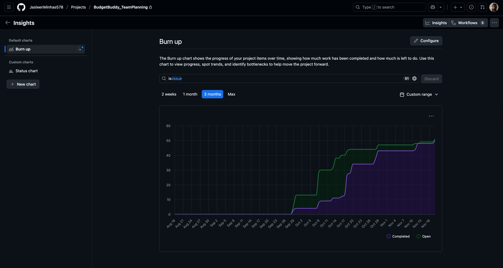

# 📌 Budget Buddy – Planning & Issues Mapping Document

**Project**: Budget Buddy  
**Date**: August 27, 2026  
**Status**: ✅ Complete — All issues resolved, 211 story points completed

This document provides a complete mapping of all project issues, story points, team responsibilities, velocity, and Agile workflow details.  
It also includes screenshots of the GitHub Project Board and a detailed contribution analysis for each team member.

> 📋 **Related Documents**:  
> - [`Documents/Requirements.md`](Documents/Requirements.md) - Functional and non-functional requirements  
> - [`Documents/Acceptance_Tests.md`](Documents/Acceptance_Tests.md) - Requirements traceability and test coverage  
> - [`README.md`](../README.md) - Project overview and documentation

---

## 📑 Table of Contents

1. [GitHub Project Board Overview](#️-1-github-project-board-overview)
2. [Issue-to-Planning Mapping Table](#-2-issue-to-planning-mapping-table)
3. [GitHub Issues Mapping by Category](#-3-github-issues-mapping-by-category)
4. [Project Velocity](#-5-project-velocity)
5. [Agile Practices Followed](#-6-agile-practices-followed)
6. [Conclusion](#-7-conclusion)

---

# 🗂️ 1. GitHub Project Board Overview

- **Project Sprint Board Link (Iterations 1–5)** : [Sprint board](https://github.com/users/JasleenMinhas578/projects/4/views/4)

- **Project Planning Board Link** : [Planning Mapping](https://github.com/users/JasleenMinhas578/projects/4/views/1)

- **Project Team Capacity Board Link** : [Team Capacity](https://github.com/users/JasleenMinhas578/projects/4/views/2)

## 📸 Screenshot of the **Burnup Chart**

---

# 📊 2. Issue-to-Planning Mapping Table
| Issue # | Title                                                                 | Story Points | Priority | Risk   | Iteration        | Assignee(s)                           | Status | PR Reference(s)                                                                 |
|---------|-----------------------------------------------------------------------|--------------|----------|--------|------------------|---------------------------------------|--------|---------------------------------------------------------------------------------|
| [5](https://github.com/JasleenMinhas578/BudgetBuddy/issues/5) | GitHub Repo Setup & Workflow                                          | 5            | High     | Medium | Iteration 1      | Jasleen                               | Done   | -                                                                               |
| [2](https://github.com/JasleenMinhas578/BudgetBuddy/issues/2) | Team Role Assignment                                                  | 0            | High     | Low    | Iteration 1      | Jasleen                               | Done   | -                                                                               |
| [1](https://github.com/JasleenMinhas578/BudgetBuddy/issues/1) | Requirements Gathering                                                | 5            | High     | Medium | Iteration 1      | Jasleen, Joel, Kaustubh, Mashroor, Sumaiya, Ronit | Done   | -                                                                               |
| [7](https://github.com/JasleenMinhas578/BudgetBuddy/issues/7) | React Frontend Setup                                                  | 3            | High     | Low    | Iteration 1      | Jasleen                               | Done   | -                                                                               |
| [4](https://github.com/JasleenMinhas578/BudgetBuddy/issues/4) | UML Diagrams (Use Case, Sequence, Class Diagrams)                    | 8            | High     | High   | Iteration 1      | Jasleen, Joel, Kaustubh, Mashroor, Sumaiya, Ronit | Done   | -                                                                               |
| [3](https://github.com/JasleenMinhas578/BudgetBuddy/issues/3) | Issues/Stories Creation in GitHub                                     | 7            | High     | Medium | Iteration 1      | Jasleen, Joel, Kaustubh, Mashroor, Sumaiya, Ronit | Done   | -                                                                               |
| [6](https://github.com/JasleenMinhas578/BudgetBuddy/issues/6) | Firebase Project Initialization                                       | 5            | High     | High   | Iteration 1      | Mashroor                              | Done   | [#17](https://github.com/JasleenMinhas578/BudgetBuddy/pull/17)                  |
| [16](https://github.com/JasleenMinhas578/BudgetBuddy/issues/16) | Make Firebase `.env` File Public for Developer Access                 | 2            | Medium   | Medium | Iteration 1      | Mashroor                              | Done   | [#18](https://github.com/JasleenMinhas578/BudgetBuddy/pull/18)                  |
| [43](https://github.com/JasleenMinhas578/BudgetBuddy/issues/43) | Sub Issue Login Page of #9 - Firebase Authentication Integration     | 5            | High     | Medium | Iteration 2      | Jasleen, Mashroor                     | Done   | [#56](https://github.com/JasleenMinhas578/BudgetBuddy/pull/56)                  |
| [9](https://github.com/JasleenMinhas578/BudgetBuddy/issues/9) | Login Page Implementation (Parent Issue)                              | 5            | High     | Medium | Iteration 2      | Jasleen, Joel, Kaustubh, Mashroor, Sumaiya, Ronit | Done   | [#55](https://github.com/JasleenMinhas578/BudgetBuddy/pull/55), [#56](https://github.com/JasleenMinhas578/BudgetBuddy/pull/56), [#57](https://github.com/JasleenMinhas578/BudgetBuddy/pull/57) |
| [10](https://github.com/JasleenMinhas578/BudgetBuddy/issues/10) | Signup Page Implementation (Parent Issue)                            | 5            | High     | Medium | Iteration 2      | Jasleen, Joel, Kaustubh, Mashroor, Sumaiya, Ronit | Done   | [#48](https://github.com/JasleenMinhas578/BudgetBuddy/pull/48), [#52](https://github.com/JasleenMinhas578/BudgetBuddy/pull/52), [#53](https://github.com/JasleenMinhas578/BudgetBuddy/pull/53), [#54](https://github.com/JasleenMinhas578/BudgetBuddy/pull/54) |
| [11](https://github.com/JasleenMinhas578/BudgetBuddy/issues/11) | Logout & Session Management (Parent Issue)                            | 3            | High     | Medium | Iteration 2      | Jasleen, Joel, Kaustubh, Mashroor, Sumaiya, Ronit | Done   | [#60](https://github.com/JasleenMinhas578/BudgetBuddy/pull/60), [#61](https://github.com/JasleenMinhas578/BudgetBuddy/pull/61) |
| [12](https://github.com/JasleenMinhas578/BudgetBuddy/issues/12) | Unit Tests for Authentication Flow                                    | 5            | High     | Medium | Iteration 2      | Jasleen, Joel                         | Done   | [#70](https://github.com/JasleenMinhas578/BudgetBuddy/pull/70)                  |
| [46](https://github.com/JasleenMinhas578/BudgetBuddy/issues/46) | Sub Issue Signup Page of #10 - Firebase Authentication Integration   | 5            | High     | Medium | Iteration 2      | Jasleen, Mashroor, Sumaiya            | Done   | [#53](https://github.com/JasleenMinhas578/BudgetBuddy/pull/53)                  |
| [13](https://github.com/JasleenMinhas578/BudgetBuddy/issues/13) | Unit Tests for Signup and Login Components (Parent Issue)            | 4            | High     | Medium | Iteration 2      | Jasleen, Joel                         | Done   | [#68](https://github.com/JasleenMinhas578/BudgetBuddy/pull/68), [#69](https://github.com/JasleenMinhas578/BudgetBuddy/pull/69) |
| [42](https://github.com/JasleenMinhas578/BudgetBuddy/issues/42) | Sub Issue Login Page of #9 - UI Layout & Styling                      | 2            | Medium   | Low    | Iteration 2      | Jasleen, Mashroor, Sumaiya            | Done   | [#55](https://github.com/JasleenMinhas578/BudgetBuddy/pull/55)                  |
| [44](https://github.com/JasleenMinhas578/BudgetBuddy/issues/44) | Sub Issue Login Page of #9 - Form Validation & Error Handling        | 3            | Medium   | Medium | Iteration 2      | Jasleen, Mashroor, Sumaiya            | Done   | [#57](https://github.com/JasleenMinhas578/BudgetBuddy/pull/57)                  |
| [50](https://github.com/JasleenMinhas578/BudgetBuddy/issues/50) | Sub-Issue for #13 - Signup Component - Unit Tests                     | 2            | High     | Medium | Iteration 2      | Jasleen, Joel                         | Done   | [#68](https://github.com/JasleenMinhas578/BudgetBuddy/pull/68)                  |
| [47](https://github.com/JasleenMinhas578/BudgetBuddy/issues/47) | Sub Issue Signup Page of #10 - Form Validation & Error Handling      | 3            | Medium   | Medium | Iteration 2      | Jasleen, Mashroor, Sumaiya            | Done   | [#54](https://github.com/JasleenMinhas578/BudgetBuddy/pull/54)                  |
| [49](https://github.com/JasleenMinhas578/BudgetBuddy/issues/49) | Sub-Issue for #13 - Login Component - Unit Tests                     | 3            | High     | Medium | Iteration 2      | Jasleen, Joel                         | Done   | [#69](https://github.com/JasleenMinhas578/BudgetBuddy/pull/69)                  |
| [8](https://github.com/JasleenMinhas578/BudgetBuddy/issues/8) | Landing Page Implementation (Parent Issue)                           | 4            | High     | Medium | Iteration 2      | Jasleen, Joel, Kaustubh, Mashroor, Sumaiya, Ronit | Done   | [#37](https://github.com/JasleenMinhas578/BudgetBuddy/pull/37), [#39](https://github.com/JasleenMinhas578/BudgetBuddy/pull/39), [#41](https://github.com/JasleenMinhas578/BudgetBuddy/pull/41) |
| [36](https://github.com/JasleenMinhas578/BudgetBuddy/issues/36) | Sub Issue Landing Page of #8 - CSS Styling & Responsiveness           | 7            | Medium   | Medium | Iteration 2      | Jasleen, Mashroor                     | Done   | [#37](https://github.com/JasleenMinhas578/BudgetBuddy/pull/37)                  |
| [38](https://github.com/JasleenMinhas578/BudgetBuddy/issues/38) | Sub Issue Landing Page of #8 - Navigation set up                      | 2            | High     | Low    | Iteration 2      | Jasleen, Mashroor                     | Done   | [#39](https://github.com/JasleenMinhas578/BudgetBuddy/pull/39)                  |
| [40](https://github.com/JasleenMinhas578/BudgetBuddy/issues/40) | Sub Issue Landing Page of #8 - Content and Branding                   | 3            | Low      | Low    | Iteration 2      | Jasleen, Kaustubh, Mashroor, Sumaiya, Ronit | Done   | [#41](https://github.com/JasleenMinhas578/BudgetBuddy/pull/41)                  |
| [45](https://github.com/JasleenMinhas578/BudgetBuddy/issues/45) | Sub Issue Signup Page of #10 - UI Layout & Styling                    | 3            | Medium   | Low    | Iteration 2      | Jasleen, Kaustubh, Sumaiya, Ronit     | Done   | [#48](https://github.com/JasleenMinhas578/BudgetBuddy/pull/48), [#52](https://github.com/JasleenMinhas578/BudgetBuddy/pull/52) |
| [58](https://github.com/JasleenMinhas578/BudgetBuddy/issues/58) | Sub Issue of #11 - Basic Dashboard Layout for logout button           | 4            | High     | Medium | Iteration 2      | Jasleen, Mashroor                     | Done   | [#60](https://github.com/JasleenMinhas578/BudgetBuddy/pull/60)                  |
| [59](https://github.com/JasleenMinhas578/BudgetBuddy/issues/59) | Sub Issue of #11 - Logout Implementation                             | 2            | Medium   | Low    | Iteration 2      | Jasleen, Mashroor                     | Done   | [#61](https://github.com/JasleenMinhas578/BudgetBuddy/pull/61)                  |
| [62](https://github.com/JasleenMinhas578/BudgetBuddy/issues/62) | CI/CD Setup and Deployment to Vercel                                  | 6            | High     | High   | Iteration 2      | Jasleen                               | Done   | [#67](https://github.com/JasleenMinhas578/BudgetBuddy/pull/67)                  |
| [20](https://github.com/JasleenMinhas578/BudgetBuddy/issues/20) | Expense Management - Add, Edit, Delete, and View (Parent Issue)       | 8            | High     | Medium | Iteration 3      | Jasleen, Joel, Kaustubh, Mashroor, Sumaiya, Ronit | Done   | [#63](https://github.com/JasleenMinhas578/BudgetBuddy/pull/63), [#64](https://github.com/JasleenMinhas578/BudgetBuddy/pull/64), [#65](https://github.com/JasleenMinhas578/BudgetBuddy/pull/65), [#71](https://github.com/JasleenMinhas578/BudgetBuddy/pull/71) |
| [21](https://github.com/JasleenMinhas578/BudgetBuddy/issues/21) | Sub-Issue, Expense Management of #20 - Add Expense UI                 | 3            | High     | Medium | Iteration 3      | Ronit, Jasleen, Kaustubh, Sumaiya     | Done   | [#63](https://github.com/JasleenMinhas578/BudgetBuddy/pull/63)                  |
| [22](https://github.com/JasleenMinhas578/BudgetBuddy/issues/22) | Sub-Issue, Expense Management of #20 - Add/Edit/Delete Expense CRUD  | 4            | High     | Medium | Iteration 3      | Ronit, Jasleen, Kaustubh, Sumaiya     | Done   | [#65](https://github.com/JasleenMinhas578/BudgetBuddy/pull/65)                  |
| [23](https://github.com/JasleenMinhas578/BudgetBuddy/issues/23) | Sub-Issue, Expense Management of #20 - Connect Expense Page to Firebase | 4          | High     | Medium | Iteration 3      | Ronit, Jasleen, Kaustubh, Sumaiya     | Done   | [#64](https://github.com/JasleenMinhas578/BudgetBuddy/pull/64)                  |
| [24](https://github.com/JasleenMinhas578/BudgetBuddy/issues/24) | Sub-Issue, Expense Management of #20 - Unit Tests for Expense Module | 2            | High     | Medium | Iteration 3      | Jasleen, Joel                         | Done   | [#71](https://github.com/JasleenMinhas578/BudgetBuddy/pull/71)                  |
| [66](https://github.com/JasleenMinhas578/BudgetBuddy/issues/66) | Sub-Issue of #62 Diagnose Preview Deployment Failure Logs            | 3            | High     | High   | Iteration 3      | Jasleen                               | Done   | [#67](https://github.com/JasleenMinhas578/BudgetBuddy/pull/67)                  |
| [26](https://github.com/JasleenMinhas578/BudgetBuddy/issues/26) | Sub-Issue, Category Management of #25 - Create Category UI           | 2            | High     | Low    | Iteration 3      | Jasleen, Kaustubh, Sumaiya, Ronit     | Done   | [#72](https://github.com/JasleenMinhas578/BudgetBuddy/pull/72)                  |
| [25](https://github.com/JasleenMinhas578/BudgetBuddy/issues/25) | Category Management - Create and Manage Categories (Parent Issue)    | 6            | High     | Medium | Iteration 3      | Jasleen, Joel, Kaustubh, Mashroor, Sumaiya, Ronit | Done   | [#72](https://github.com/JasleenMinhas578/BudgetBuddy/pull/72), [#73](https://github.com/JasleenMinhas578/BudgetBuddy/pull/73), [#75](https://github.com/JasleenMinhas578/BudgetBuddy/pull/75), [#76](https://github.com/JasleenMinhas578/BudgetBuddy/pull/76), [#80](https://github.com/JasleenMinhas578/BudgetBuddy/pull/80) |
| [28](https://github.com/JasleenMinhas578/BudgetBuddy/issues/28) | Sub-Issue, Category Management of #25 - Connect Categories to Firebase | 4          | High     | Medium | Iteration 3      | Mashroor                              | Done   | [#73](https://github.com/JasleenMinhas578/BudgetBuddy/pull/73)                  |
| [29](https://github.com/JasleenMinhas578/BudgetBuddy/issues/29) | Sub-Issue, Category Management of #25 - Unit Tests for Category Module | 2          | Medium   | Low    | Iteration 3      | Jasleen, Joel                         | Done   | [#76](https://github.com/JasleenMinhas578/BudgetBuddy/pull/76)                  |
| [78](https://github.com/JasleenMinhas578/BudgetBuddy/issues/78) | Sub-Issue, Category Management of #25 - Delete the Category          | 2            | Medium   | Medium | Iteration 3      | Jasleen, Mashroor                     | Done   | [#80](https://github.com/JasleenMinhas578/BudgetBuddy/pull/80)                  |
| [81](https://github.com/JasleenMinhas578/BudgetBuddy/issues/81) | UI/UX Enhancements and Styling Fixes                                  | 3            | Medium   | Low    | Iteration 3      | Jasleen, Mashroor                     | Done   | [#82](https://github.com/JasleenMinhas578/BudgetBuddy/pull/82)                  |
| [85](https://github.com/JasleenMinhas578/BudgetBuddy/issues/85) | Documentation and README Enhancements                                 | 3            | High     | Low    | Iteration 3      | Jasleen, Joel, Kaustubh, Mashroor, Sumaiya, Ronit | Done   | [#86](https://github.com/JasleenMinhas578/BudgetBuddy/pull/86)                  |
| [30](https://github.com/JasleenMinhas578/BudgetBuddy/issues/30) | Dashboard & Reporting - Visualize and Generate Expense Insights (Parent) | 8        | High     | High   | Iteration 4      | Jasleen, Joel, Kaustubh, Mashroor, Sumaiya, Ronit | Done   | [#77](https://github.com/JasleenMinhas578/BudgetBuddy/pull/77), [#79](https://github.com/JasleenMinhas578/BudgetBuddy/pull/79), [#89](https://github.com/JasleenMinhas578/BudgetBuddy/pull/89), [#90](https://github.com/JasleenMinhas578/BudgetBuddy/pull/90) |
| [31](https://github.com/JasleenMinhas578/BudgetBuddy/issues/31) | Sub-Issue, Dashboard & Reporting of #30 - Dashboard UI Layout        | 3            | Medium   | Low    | Iteration 4      | Jasleen, Kaustubh, Sumaiya, Ronit     | Done   | [#77](https://github.com/JasleenMinhas578/BudgetBuddy/pull/77)                  |
| [32](https://github.com/JasleenMinhas578/BudgetBuddy/issues/32) | Sub-Issue, Dashboard & Reporting of #30 - Chart Visualization        | 4            | Medium   | High   | Iteration 4      | Jasleen, Kaustubh, Ronit              | Done   | [#79](https://github.com/JasleenMinhas578/BudgetBuddy/pull/79)                  |
| [33](https://github.com/JasleenMinhas578/BudgetBuddy/issues/33) | Sub-Issue, Dashboard & Reporting of #30 - Expense Summary Widgets    | 3            | High     | Medium | Iteration 4      | Jasleen, Kaustubh, Sumaiya, Ronit     | Done   | [#89](https://github.com/JasleenMinhas578/BudgetBuddy/pull/89)                  |
| [34](https://github.com/JasleenMinhas578/BudgetBuddy/issues/34) | Sub-Issue, Dashboard & Reporting of #30 - Report Generation (PDF/CSV) | 4            | Medium   | High   | Iteration 4      | Jasleen, Kaustubh, Mashroor, Sumaiya, Ronit | Done   | [#89](https://github.com/JasleenMinhas578/BudgetBuddy/pull/89)                  |
| [35](https://github.com/JasleenMinhas578/BudgetBuddy/issues/35) | Sub-Issue, Dashboard & Reporting of #30 - Unit Tests for Dashboard   | 3            | Medium   | Medium | Iteration 4      | Jasleen, Joel                         | Done   | [#90](https://github.com/JasleenMinhas578/BudgetBuddy/pull/90)                  |
| [87](https://github.com/JasleenMinhas578/BudgetBuddy/issues/87) | Add Forget Password Functionality                                    | 3            | High     | Medium | Iteration 4      | Jasleen, Mashroor                     | Done   | [#88](https://github.com/JasleenMinhas578/BudgetBuddy/pull/88)                  |
| [91](https://github.com/JasleenMinhas578/BudgetBuddy/issues/91) | Browser-Level UI Testing with Cypress (E2E Testing)                   | 9            | High     | High   | Iteration 5      | Jasleen, Joel, Mashroor               | Done   | [#93](https://github.com/JasleenMinhas578/BudgetBuddy/pull/93)                  |
| [94](https://github.com/JasleenMinhas578/BudgetBuddy/issues/94) | Improve Test Coverage & Add Cross-Browser E2E Testing                | 6            | High     | High   | Iteration 5      | Jasleen, Mashroor                     | Done   | [#95](https://github.com/JasleenMinhas578/BudgetBuddy/pull/95), [#97](https://github.com/JasleenMinhas578/BudgetBuddy/pull/97) |
| [98](https://github.com/JasleenMinhas578/BudgetBuddy/issues/98) | Implement End-to-End Final Checklist as Requested by TA/Stakeholder  | 5            | High     | High   | Iteration 5      | Jasleen, Mashroor   | Done   | [#99](https://github.com/JasleenMinhas578/BudgetBuddy/pull/99)  |
| [100](https://github.com/JasleenMinhas578/BudgetBuddy/issues/100) | Perform Lighthouse Accessibility Audit  | 3           | High     | Low   | Iteration 5      | Jasleen, Mashroor                               | Done   | [#101](https://github.com/JasleenMinhas578/BudgetBuddy/pull/101)  |
| [102](https://github.com/JasleenMinhas578/BudgetBuddy/issues/102) | Generate ESLint Report and Fix All Linting Issues  | 3           | High     | Medium   | Iteration 5      | Jasleen, Mashroor                               | Done   | [#103](https://github.com/JasleenMinhas578/BudgetBuddy/pull/103)  |

                                                                             
#### **📌 Total Issues (User Stories):** 53 (Feature Issues: 29, Infrastructure Issues: 24)
#### **📌 Total Completed Story Points:** 211 

---

# 📋 3. GitHub Issues Mapping by Category

This section provides a comprehensive mapping of all GitHub issues organized by feature categories and infrastructure categories.

> 📌 **Note**: The GitHub Issues themselves serve as the user stories. Issues are organized into 7 feature categories (US-001 through US-007) for better tracking and planning.

## 3.1 Feature Issues

### US-001: User Registration (16 SP, 4 issues)
| Issue # | Title | Story Points | PR Reference(s) |
|---------|-------|--------------|-----------------|
| [#10](https://github.com/JasleenMinhas578/BudgetBuddy/issues/10) | Signup Page Implementation (Parent Issue) | 5 | [#48](https://github.com/JasleenMinhas578/BudgetBuddy/pull/48), [#52](https://github.com/JasleenMinhas578/BudgetBuddy/pull/52), [#53](https://github.com/JasleenMinhas578/BudgetBuddy/pull/53), [#54](https://github.com/JasleenMinhas578/BudgetBuddy/pull/54) |
| [#45](https://github.com/JasleenMinhas578/BudgetBuddy/issues/45) | Sub Issue Signup Page of #10 - UI Layout & Styling | 3 | [#48](https://github.com/JasleenMinhas578/BudgetBuddy/pull/48), [#52](https://github.com/JasleenMinhas578/BudgetBuddy/pull/52) |
| [#46](https://github.com/JasleenMinhas578/BudgetBuddy/issues/46) | Sub Issue Signup Page of #10 - Firebase Authentication Integration | 5 | [#53](https://github.com/JasleenMinhas578/BudgetBuddy/pull/53) |
| [#47](https://github.com/JasleenMinhas578/BudgetBuddy/issues/47) | Sub Issue Signup Page of #10 - Form Validation & Error Handling | 3 | [#54](https://github.com/JasleenMinhas578/BudgetBuddy/pull/54) |

**Total**: 4 issues, 16 SP 

### US-002: User Login (18 SP, 5 issues)
| Issue # | Title | Story Points | PR Reference(s) |
|---------|-------|--------------|-----------------|
| [#9](https://github.com/JasleenMinhas578/BudgetBuddy/issues/9) | Login Page Implementation (Parent Issue) | 5 | [#55](https://github.com/JasleenMinhas578/BudgetBuddy/pull/55), [#56](https://github.com/JasleenMinhas578/BudgetBuddy/pull/56), [#57](https://github.com/JasleenMinhas578/BudgetBuddy/pull/57) |
| [#42](https://github.com/JasleenMinhas578/BudgetBuddy/issues/42) | Sub Issue Login Page of #9 - UI Layout & Styling | 2 | [#55](https://github.com/JasleenMinhas578/BudgetBuddy/pull/55) |
| [#43](https://github.com/JasleenMinhas578/BudgetBuddy/issues/43) | Sub Issue Login Page of #9 - Firebase Authentication Integration | 5 | [#56](https://github.com/JasleenMinhas578/BudgetBuddy/pull/56) |
| [#44](https://github.com/JasleenMinhas578/BudgetBuddy/issues/44) | Sub Issue Login Page of #9 - Form Validation & Error Handling | 3 | [#57](https://github.com/JasleenMinhas578/BudgetBuddy/pull/57) |
| [#87](https://github.com/JasleenMinhas578/BudgetBuddy/issues/87) | Add Forget Password Functionality | 3 | [#88](https://github.com/JasleenMinhas578/BudgetBuddy/pull/88) |

**Total**: 5 issues, 18 SP 

### US-003: View Dashboard (18 SP, 4 issues)
| Issue # | Title | Story Points | PR Reference(s) |
|---------|-------|--------------|-----------------|
| [#30](https://github.com/JasleenMinhas578/BudgetBuddy/issues/30) | Dashboard & Reporting - Visualize and Generate Expense Insights (Parent) | 8 | [#77](https://github.com/JasleenMinhas578/BudgetBuddy/pull/77), [#79](https://github.com/JasleenMinhas578/BudgetBuddy/pull/79), [#89](https://github.com/JasleenMinhas578/BudgetBuddy/pull/89), [#90](https://github.com/JasleenMinhas578/BudgetBuddy/pull/90) |
| [#31](https://github.com/JasleenMinhas578/BudgetBuddy/issues/31) | Sub-Issue, Dashboard & Reporting of #30 - Dashboard UI Layout | 3 | [#77](https://github.com/JasleenMinhas578/BudgetBuddy/pull/77) |
| [#33](https://github.com/JasleenMinhas578/BudgetBuddy/issues/33) | Sub-Issue, Dashboard & Reporting of #30 - Expense Summary Widgets | 3 | [#89](https://github.com/JasleenMinhas578/BudgetBuddy/pull/89) |
| [#58](https://github.com/JasleenMinhas578/BudgetBuddy/issues/58) | Sub Issue of #11 - Basic Dashboard Layout for logout button | 4 | [#60](https://github.com/JasleenMinhas578/BudgetBuddy/pull/60) |

**Total**: 4 issues, 18 SP 

### US-004: Manage Expenses (21 SP, 5 issues)
| Issue # | Title | Story Points | PR Reference(s) |
|---------|-------|--------------|-----------------|
| [#20](https://github.com/JasleenMinhas578/BudgetBuddy/issues/20) | Expense Management - Add, Edit, Delete, and View (Parent Issue) | 8 | [#63](https://github.com/JasleenMinhas578/BudgetBuddy/pull/63), [#64](https://github.com/JasleenMinhas578/BudgetBuddy/pull/64), [#65](https://github.com/JasleenMinhas578/BudgetBuddy/pull/65), [#71](https://github.com/JasleenMinhas578/BudgetBuddy/pull/71) |
| [#21](https://github.com/JasleenMinhas578/BudgetBuddy/issues/21) | Sub-Issue, Expense Management of #20 - Add Expense UI | 3 | [#63](https://github.com/JasleenMinhas578/BudgetBuddy/pull/63) |
| [#22](https://github.com/JasleenMinhas578/BudgetBuddy/issues/22) | Sub-Issue, Expense Management of #20 - Add/Edit/Delete Expense CRUD | 4 | [#65](https://github.com/JasleenMinhas578/BudgetBuddy/pull/65) |
| [#23](https://github.com/JasleenMinhas578/BudgetBuddy/issues/23) | Sub-Issue, Expense Management of #20 - Connect Expense Page to Firebase | 4 | [#64](https://github.com/JasleenMinhas578/BudgetBuddy/pull/64) |
| [#24](https://github.com/JasleenMinhas578/BudgetBuddy/issues/24) | Sub-Issue, Expense Management of #20 - Unit Tests for Expense Module | 2 | [#71](https://github.com/JasleenMinhas578/BudgetBuddy/pull/71) |

**Total**: 5 issues, 21 SP 

### US-005: Manage Categories (16 SP, 5 issues)
| Issue # | Title | Story Points | PR Reference(s) |
|---------|-------|--------------|-----------------|
| [#25](https://github.com/JasleenMinhas578/BudgetBuddy/issues/25) | Category Management - Create and Manage Categories (Parent Issue) | 6 | [#72](https://github.com/JasleenMinhas578/BudgetBuddy/pull/72), [#73](https://github.com/JasleenMinhas578/BudgetBuddy/pull/73), [#75](https://github.com/JasleenMinhas578/BudgetBuddy/pull/75), [#76](https://github.com/JasleenMinhas578/BudgetBuddy/pull/76), [#80](https://github.com/JasleenMinhas578/BudgetBuddy/pull/80) |
| [#26](https://github.com/JasleenMinhas578/BudgetBuddy/issues/26) | Sub-Issue, Category Management of #25 - Create Category UI | 2 | [#72](https://github.com/JasleenMinhas578/BudgetBuddy/pull/72) |
| [#28](https://github.com/JasleenMinhas578/BudgetBuddy/issues/28) | Sub-Issue, Category Management of #25 - Connect Categories to Firebase | 4 | [#73](https://github.com/JasleenMinhas578/BudgetBuddy/pull/73) |
| [#29](https://github.com/JasleenMinhas578/BudgetBuddy/issues/29) | Sub-Issue, Category Management of #25 - Unit Tests for Category Module | 2 | [#76](https://github.com/JasleenMinhas578/BudgetBuddy/pull/76) |
| [#78](https://github.com/JasleenMinhas578/BudgetBuddy/issues/78) | Sub-Issue, Category Management of #25 - Delete the Category | 2 | [#80](https://github.com/JasleenMinhas578/BudgetBuddy/pull/80) |

**Total**: 5 issues, 16 SP

### US-006: Generate Reports (19 SP, 4 issues)
| Issue # | Title | Story Points | PR Reference(s) |
|---------|-------|--------------|-----------------|
| [#30](https://github.com/JasleenMinhas578/BudgetBuddy/issues/30) | Dashboard & Reporting - Visualize and Generate Expense Insights (Parent) | 8 | [#77](https://github.com/JasleenMinhas578/BudgetBuddy/pull/77), [#79](https://github.com/JasleenMinhas578/BudgetBuddy/pull/79), [#89](https://github.com/JasleenMinhas578/BudgetBuddy/pull/89), [#90](https://github.com/JasleenMinhas578/BudgetBuddy/pull/90) |
| [#32](https://github.com/JasleenMinhas578/BudgetBuddy/issues/32) | Sub-Issue, Dashboard & Reporting of #30 - Chart Visualization | 4 | [#79](https://github.com/JasleenMinhas578/BudgetBuddy/pull/79) |
| [#34](https://github.com/JasleenMinhas578/BudgetBuddy/issues/34) | Sub-Issue, Dashboard & Reporting of #30 - Report Generation (PDF/CSV) | 4 | [#89](https://github.com/JasleenMinhas578/BudgetBuddy/pull/89) |
| [#35](https://github.com/JasleenMinhas578/BudgetBuddy/issues/35) | Sub-Issue, Dashboard & Reporting of #30 - Unit Tests for Dashboard | 3 | [#90](https://github.com/JasleenMinhas578/BudgetBuddy/pull/90) |

**Total**: 4 issues, 19 SP 

### US-007: User Logout (5 SP, 2 issues)
| Issue # | Title | Story Points | PR Reference(s) |
|---------|-------|--------------|-----------------|
| [#11](https://github.com/JasleenMinhas578/BudgetBuddy/issues/11) | Logout & Session Management (Parent Issue) | 3 | [#60](https://github.com/JasleenMinhas578/BudgetBuddy/pull/60), [#61](https://github.com/JasleenMinhas578/BudgetBuddy/pull/61) |
| [#59](https://github.com/JasleenMinhas578/BudgetBuddy/issues/59) | Sub Issue of #11 - Logout Implementation | 2 | [#61](https://github.com/JasleenMinhas578/BudgetBuddy/pull/61) |

**Total**: 2 issues, 5 SP 

### Feature Issues Summary
| Category | Issues | Story Points (Allocated) | 
|----------|--------|-------------------------|
| **US-001: User Registration** | 4 | 16 SP |
| **US-002: User Login** | 5 | 18 SP |
| **US-003: View Dashboard** | 4 | 18 SP |
| **US-004: Manage Expenses** | 5 |  21 SP |
| **US-005: Manage Categories** | 5 | 16 SP |
| **US-006: Generate Reports** | 4 | 19 SP |
| **US-007: User Logout** | 2 |  5 SP |
| **TOTAL** | **29** | **113 SP** |

---

## 3.2 Infrastructure Issues

### Project Setup & Planning
| Issue # | Title | Story Points | PR Reference(s) |
|---------|-------|--------------|-----------------|
| [#1](https://github.com/JasleenMinhas578/BudgetBuddy/issues/1) | Requirements Gathering | 5 | - |
| [#2](https://github.com/JasleenMinhas578/BudgetBuddy/issues/2) | Team Role Assignment | 0 | - |
| [#3](https://github.com/JasleenMinhas578/BudgetBuddy/issues/3) | Issues/Stories Creation in GitHub | 7 | - |
| [#4](https://github.com/JasleenMinhas578/BudgetBuddy/issues/4) | UML Diagrams (Use Case, Sequence, Class Diagrams) | 8 | - |
| [#5](https://github.com/JasleenMinhas578/BudgetBuddy/issues/5) | GitHub Repo Setup & Workflow | 5 | - |
| [#6](https://github.com/JasleenMinhas578/BudgetBuddy/issues/6) | Firebase Project Initialization | 5 | [#17](https://github.com/JasleenMinhas578/BudgetBuddy/pull/17) |
| [#7](https://github.com/JasleenMinhas578/BudgetBuddy/issues/7) | React Frontend Setup | 3 | - |
| [#16](https://github.com/JasleenMinhas578/BudgetBuddy/issues/16) | Make Firebase `.env` File Public for Developer Access | 2 | [#18](https://github.com/JasleenMinhas578/BudgetBuddy/pull/18) |

**Total**: 8 issues, 35 SP

### Landing Page 
| Issue # | Title | Story Points | PR Reference(s) |
|---------|-------|--------------|-----------------|
| [#8](https://github.com/JasleenMinhas578/BudgetBuddy/issues/8) | Landing Page Implementation (Parent Issue) | 4 | [#37](https://github.com/JasleenMinhas578/BudgetBuddy/pull/37), [#39](https://github.com/JasleenMinhas578/BudgetBuddy/pull/39), [#41](https://github.com/JasleenMinhas578/BudgetBuddy/pull/41) |
| [#36](https://github.com/JasleenMinhas578/BudgetBuddy/issues/36) | Sub Issue Landing Page of #8 - CSS Styling & Responsiveness | 7 | [#37](https://github.com/JasleenMinhas578/BudgetBuddy/pull/37) |
| [#38](https://github.com/JasleenMinhas578/BudgetBuddy/issues/38) | Sub Issue Landing Page of #8 - Navigation set up | 2 | [#39](https://github.com/JasleenMinhas578/BudgetBuddy/pull/39) |
| [#40](https://github.com/JasleenMinhas578/BudgetBuddy/issues/40) | Sub Issue Landing Page of #8 - Content and Branding | 3 | [#41](https://github.com/JasleenMinhas578/BudgetBuddy/pull/41) |

**Total**: 4 issues, 16 SP

### Testing Infrastructure
| Issue # | Title | Story Points | PR Reference(s) |
|---------|-------|--------------|-----------------|
| [#12](https://github.com/JasleenMinhas578/BudgetBuddy/issues/12) | Unit Tests for Authentication Flow | 5 | [#70](https://github.com/JasleenMinhas578/BudgetBuddy/pull/70) |
| [#13](https://github.com/JasleenMinhas578/BudgetBuddy/issues/13) | Unit Tests for Signup and Login Components (Parent Issue) | 4 | [#68](https://github.com/JasleenMinhas578/BudgetBuddy/pull/68), [#69](https://github.com/JasleenMinhas578/BudgetBuddy/pull/69) |
| [#50](https://github.com/JasleenMinhas578/BudgetBuddy/issues/50) | Sub-Issue for #13 - Signup Component - Unit Tests | 2 | [#68](https://github.com/JasleenMinhas578/BudgetBuddy/pull/68) |
| [#49](https://github.com/JasleenMinhas578/BudgetBuddy/issues/49) | Sub-Issue for #13 - Login Component - Unit Tests | 3 | [#69](https://github.com/JasleenMinhas578/BudgetBuddy/pull/69) |
| [#91](https://github.com/JasleenMinhas578/BudgetBuddy/issues/91) | Browser-Level UI Testing with Cypress (E2E Testing) | 9 | [#93](https://github.com/JasleenMinhas578/BudgetBuddy/pull/93) |
| [#94](https://github.com/JasleenMinhas578/BudgetBuddy/issues/94) | Improve Test Coverage & Add Cross-Browser E2E Testing | 6 | [#95](https://github.com/JasleenMinhas578/BudgetBuddy/pull/95), [#97](https://github.com/JasleenMinhas578/BudgetBuddy/pull/97) |

**Total**: 6 issues, 29 SP

### CI/CD & Deployment
| Issue # | Title | Story Points | PR Reference(s) |
|---------|-------|--------------|-----------------|
| [#62](https://github.com/JasleenMinhas578/BudgetBuddy/issues/62) | CI/CD Setup and Deployment to Vercel | 6 | [#67](https://github.com/JasleenMinhas578/BudgetBuddy/pull/67) |
| [#66](https://github.com/JasleenMinhas578/BudgetBuddy/issues/66) | Sub-Issue of #62 Diagnose Preview Deployment Failure Logs | 3 | [#67](https://github.com/JasleenMinhas578/BudgetBuddy/pull/67) |

**Total**: 2 issues, 9 SP

### Documentation & Quality 
| Issue # | Title | Story Points | PR Reference(s) |
|---------|-------|--------------|-----------------|
| [#81](https://github.com/JasleenMinhas578/BudgetBuddy/issues/81) | UI/UX Enhancements and Styling Fixes | 3 | [#82](https://github.com/JasleenMinhas578/BudgetBuddy/pull/82) |
| [#85](https://github.com/JasleenMinhas578/BudgetBuddy/issues/85) | Documentation and README Enhancements | 3 | [#86](https://github.com/JasleenMinhas578/BudgetBuddy/pull/86) |
| [#98](https://github.com/JasleenMinhas578/BudgetBuddy/issues/98) | Implement End-to-End Final Checklist as Requested by TA/Stakeholder | 5 | [#99](https://github.com/JasleenMinhas578/BudgetBuddy/pull/99) |
| [#100](https://github.com/JasleenMinhas578/BudgetBuddy/issues/100) | Perform Lighthouse Accessibility Audit | 3 | [#101](https://github.com/JasleenMinhas578/BudgetBuddy/pull/101) |
| [#102](https://github.com/JasleenMinhas578/BudgetBuddy/issues/102) | Generate ESLint Report and Fix All Linting Issues | 3 | [#103](https://github.com/JasleenMinhas578/BudgetBuddy/pull/103) |

**Total**: 5 issues, 17 SP

### Infrastructure Summary
| Category | Issues | Story Points |
|----------|--------|--------------|
| **Project Setup & Planning** | 8 | 35 SP |
| **Landing Page** | 4 | 16 SP |
| **Testing Infrastructure** | 6 | 29 SP |
| **CI/CD & Deployment** | 2 | 9 SP |
| **Documentation & Quality** | 5 | 17 SP |
| **TOTAL** | **24** | **98 SP** |

---

## 3.3 Complete Project Summary

| Category | Issues | Story Points (Allocated) |
|----------|--------|-------------------------|
| **Feature Issues** | 29 | 113 SP |
| **Infrastructure** | 24 |98 SP |
| **GRAND TOTAL** | **53** | **211 SP** |

> 📋 **Note**: The "Allocated" story points represent the official story point assignment for feature issues and infrastructure. The "Total" story points include all sub-issues and related work. Some issues contribute to multiple categories (e.g., #30 appears in both Dashboard and Reports).

---

# 📈 6. Project Velocity

Velocity = **Average Story Points Completed per Sprint**

| Sprint | Story Points Completed |
|--------|-------------------------|
| Sprint 1 | 35 SP |
| Sprint 2 | 76 SP |
| Sprint 3 | 46 SP |
| Sprint 4 | 28 SP |
| Sprint 5 | 26 SP |

**📌 Total Completed Story Points: 211**

**📌 Average Velocity ≈ 42 SP per Sprint**

This shows consistent productivity and healthy iteration cycles.

---

# 🌀 7. Agile Practices Followed

### ✔ **Scrum-Based Iterations**
- 5 structured sprints  
- Each sprint had clear deliverables and acceptance criteria  

### ✔ **Extreme Programming (XP) Practices**
- **Issues as User Stories**: All core functionality was captured as GitHub issues (which serve as user stories) with explicit acceptance criteria.
- **Pair Programming**: **The majority of coding work (features, tests, and refactoring) was done using pair programming**, where two team members collaboratively implemented and reviewed code in real time.
- **Test-Driven Development (TDD)**: Many critical components (authentication, dashboard, expense and category management) were implemented with tests written first or in very short red‑green‑refactor cycles.
- **Refactoring**: Continuous refactoring was performed across sprints (especially during ESLint cleanup, architecture refinement, and naming-convention alignment) to improve design quality without changing observable behavior.

### ✔ **Issues + Story Points**
- Every feature broken into issues (5–8 SP major features)  
- Proper estimation in planning sessions  

### ✔ **Daily Standups (Asynchronous)**
- Team discussed blockers, progress in group chat  

### ✔ **Sprint Reviews**
- Demo after every sprint  
- Stakeholder/TA feedback incorporated  

### ✔ **Sprint Retrospectives**
- Identified bottlenecks (Firebase errors, deployment issues)  
- Improved collaboration & code merging strategy  

### ✔ **GitHub Project Board / Kanban**
- Columns: Todo → In Progress → Review → Done  
- Issues, PRs, linked commits  
- Full transparency of work  

### ✔ **CI/CD Integration**
- Automated deploys via Vercel and Github Actions  
- Preview deployments for pull requests  

### ✔ **Testing Culture**
- Unit tests  
- Integration tests  
- Cypress E2E browser-level testing  
- Cross-browser testing (Chrome, Firefox, Edge)  

### ✔ **Documentation**
- README, developer docs, architecture, planning docs  
- This Planning_Mapping.md  

---

# 📚 8. Conclusion

This document summarizes:

- Full issue-to-planning mapping (54 issues, 211 story points)
- Agile process followed (5 iterations, 42 SP average velocity)
- Planning and execution transparency
- Final project velocity (211 SP total)
- Team responsibilities and collaboration breakdown

## 📊 Project Summary

| Metric | Value |
|--------|-------|
| **Total Issues** | 100 |
| **Total Story Points** | 211 SP |
| **Total Issues** | 53 Issues |
| **Feature Issue Points** | 113 SP (29 feature issues organized into 7 categories) |
| **Infrastructure Points** | 98 SP (24 Issues) |
| **Iterations** | 5 (10 weeks) |
| **Average Velocity** | 42 SP per sprint |
| **Status** | ✅ Complete |

> 📋 **For detailed requirements traceability**: See [`Documents/Acceptance_Tests.md`](Documents/Acceptance_Tests.md)  
> 📋 **For complete requirements list**: See [`Documents/Requirements.md`](Documents/Requirements.md)

---

