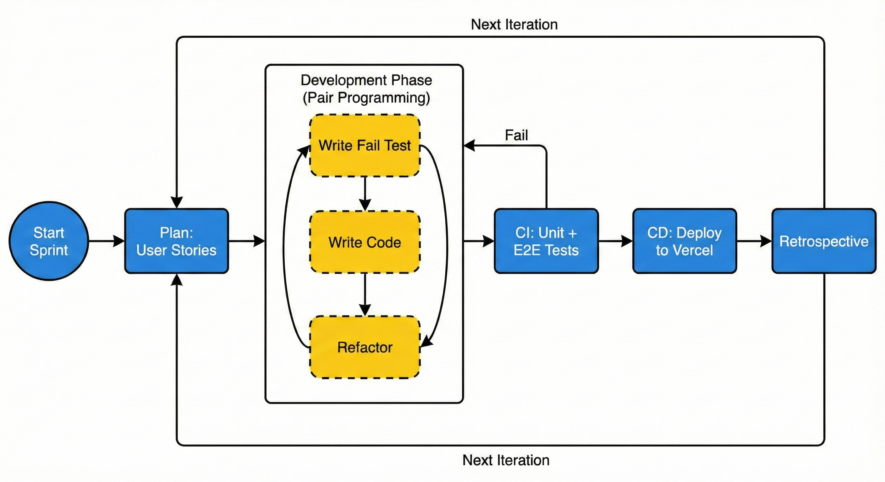
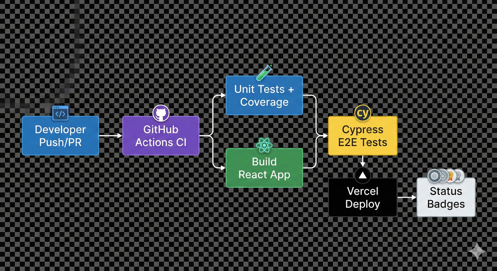

# 💸 Budget Buddy

> **Live Application**: [https://budget-buddy-mun.vercel.app/](https://budget-buddy-mun.vercel.app/) — the frontend and the Express API both deploy from this one Vercel project. The API runs as a Vercel serverless function (`api/index.js`) that directly imports and calls `server/index.js`'s Express app (no adapter needed — Express apps are valid `(req, res)` handlers), talking to the same AWS RDS Postgres + AWS Cognito backend as local dev.

> 📖 **Project evolution**: sections below describing sprints, story points, and the original Firebase/Firestore architecture document the original academic group project. The tech stack has since evolved into a solo portfolio project — see [`ROADMAP.md`](ROADMAP.md) for the full migration history (self-hosted Postgres on AWS RDS, AWS Cognito auth, and a RAG-based AI chat rebuild). The **Architecture** and **How to Run** sections below reflect the current stack. A learning-focused move to a fully self-managed **EC2 + Docker Compose** deployment is still planned (see ROADMAP.md Phase 6) — Vercel serverless is the real, live deployment in the meantime, not a placeholder.

---

## 📑 Table of Contents

- [🚀 Project Overview](#-project-overview)
- [📊 Project Status & Quick Links](#-project-status--quick-links)
- [🖥️ Methodology & Iterations](#️-methodology--iterations)
- [🗒️ Iterations Summary](#-iterations-summary)
- [📋 Feature Issues](#-feature-issues)
- [🛠️ Technologies & Tools](#️-technologies--tools)
- [🏗️ Architecture](#️-architecture)
- [🚀 How to Run the Project](#-how-to-run-the-project)
- [🧪 Testing](#-testing)
- [👤 Beta Acceptance Testing](#-beta-acceptance-testing)
- [🔄 CI/CD Pipeline](#-cicd-pipeline)
- [📊 Quality Reports](#-quality-reports)
- [📂 Deliverables](#-deliverables)
- [🎯 Challenges Faced & Lessons Learned](#-challenges-faced--lessons-learned)
- [🚀 Future Enhancements](#-future-enhancements)
- [📚 References](#-references)
- [📎 Appendices](#-appendices)

---

## 🚀 Project Overview

Budget Buddy is a **free, easy-to-use web application** for managing personal expenses. Unlike many market apps that become paid after trial, Budget Buddy focuses on **cost-effectiveness, accessibility, and simplicity**.

### Core Features
- ✅ Secure authentication (AWS Cognito)
- ✅ Expense and category management (CRUD operations, via a self-hosted Express + Postgres API)
- ✅ Data visualization (Pie, Bar, Line charts)
- ✅ Report generation (PDF & CSV export)
- ✅ Responsive design (desktop, tablet, mobile)
- ✅ Live data sync within a tab (custom pub/sub — refetches and notifies subscribers after every mutation)
- ✅ **User settings** — update display name, send password-reset email, and save a default date-range preference that persists across sessions
- ✅ **Shared date-range context** — a single date filter shared across Dashboard, Expenses, and Categories; loads the user's saved preference on login. Available presets: Today, This Week, This Month, Last Month, **Select Month** (pick any specific month from a dropdown), This Year, Last Year, All Time, and Custom Range
- ✅ **AI chat assistant** — add, edit, and delete expenses/categories/budget goals in plain English; query spending data with natural-language date ranges (powered by Google Gemini via real tool-calling/RAG — the AI calls SQL-backed tools against your own data instead of guessing from a stuffed prompt; see [`Documents/AI_Chat_Feature.md`](Documents/AI_Chat_Feature.md))
- ✅ **Budget goals** — set monthly per-category spending limits on the Goals page; real-time progress bars and alerts (on-track / near-limit / over-budget) surface on the Goals page and as an inline BudgetProgressPanel on the dashboard overview
- ✅ **Global live search** — Navbar search bar with real-time expense and category results; highlights matching text, supports amount queries from 1 digit, and navigates directly to the matched item
- ✅ **Multi-currency support** — choose a home currency and a display currency in Settings; live exchange rates (open.er-api.com) convert amounts app-wide with symbol-aware formatting and fallback rates

### Testing & Quality Assurance
- **Unit Testing**: Jest + React Testing Library (305 tests, 100% coverage)
- **E2E Testing**: Cypress (102 tests across 8 test files)
- **Code Quality**: ESLint (0 errors, 0 warnings)
- **Acceptance Testing**: Issues coverage
- **Performance**: Lighthouse (99% performance, 100% accessibility)
- **CI/CD**: GitHub Actions + Vercel deployment

---

## 📊 Project Status & Quick Links

### ✅ Current Status
- **All Tests Passing**: 305 unit tests + 102 E2E tests
- **Code Quality**: 100% (0 ESLint errors/warnings)
- **Test Coverage**: 100% (statements, branches, functions, lines)
- **Acceptance Testing**: 100% (requirements and issues coverage)
- **Performance**: 99/100 (Lighthouse)

### 🔗 Quick Links

| Resource | Link |
|----------|------|
| **Live Application** | [budget-buddy-mun.vercel.app](https://budget-buddy-mun.vercel.app/) |
| **CI/CD Results** | [GitHub Actions](https://github.com/JasleenMinhas578/BudgetBuddy/actions) |
| **Deployments** | [Vercel Deployments](https://github.com/JasleenMinhas578/BudgetBuddy/deployments/Production) |
| **Planning Board** | [GitHub Projects](https://github.com/users/JasleenMinhas578/projects/4/views/1) |
| **Requirements Document** | [`Documents/Requirements.md`](Documents/Requirements.md) |
| **Planning & Issues Mapping** | [`Documents/Planning_Mapping.md`](Documents/Planning_Mapping.md) |
| **Architecture Diagrams** | [`Documents/Architecture_Diagrams.md`](Documents/Architecture_Diagrams.md) |
| **ESLint Report** | [`eslint-report/ESLint_Report.md`](eslint-report/ESLint_Report.md) |
| **Lighthouse Report** | [`Documents/Lighthouse_Metrics/`](Documents/Lighthouse_Metrics/) |
| **Acceptance Tests & Requirements** | [`Documents/Acceptance_Tests.md`](Documents/Acceptance_Tests.md) |
| **E2E Test Docs** | [`Documents/Cypress_E2E_Testing/`](Documents/Cypress_E2E_Testing/) |
| **Unit Test Docs** | [`Documents/Jest_Unit_Testing/`](Documents/Jest_Unit_Testing/) |
| **Suggested Improvements Document** | [`Documents/Suggested_Improvements_Documents.pdf`](Documents/Suggested_Improvements_Documents.pdf) |
| **AI Feature Documentation** | [`Documents/AI_Chat_Feature.md`](Documents/AI_Chat_Feature.md) |
| **API Reference** | [`Documents/API_Reference.md`](Documents/API_Reference.md) |

---

## 🖥️ Methodology & Iterations

### Methodology
We follow **Agile Software Development** with an iterative sprint-based approach, complemented by key practices from **Extreme Programming (XP)**:
- 5 sprints (2 weeks each) with clear milestones
- GitHub Projects, Issues, and Milestones for planning
- Incremental feature implementation with testing
- Continuous Integration (CI) and Continuous Deployment (CD)
  
In particular, we adopted **four core XP practices** throughout the project:
- **Issues as User Stories**: All functionality was captured and planned as GitHub issues (which serve as user stories) with clear acceptance criteria.
- **Pair Programming**: **Most of the production code was written in pairs**, with two developers collaborating at one workstation to improve design quality, knowledge sharing, and defect detection.
- **Test-Driven Development (TDD)**: Many modules (especially authentication, dashboard, and expense management) were developed with tests written first or in very tight red‑green‑refactor loops.
- **Refactoring**: We continuously refactored code (e.g., during ESLint fixes, test improvements, and architecture cleanup) to improve readability, maintainability, and adherence to our naming and style conventions.

### 📈 Visual: How We Worked Each Sprint



--- 
## 🖥️ Iterations Summary

| Iteration | Dates | Story Points | Key Deliverables | GitHub Issues |
|-----------|-------|--------------|------------------|--------------|
| **Iteration 1** | Sept 22 – Oct 5 | 35 SP | Requirements, UML diagrams, repo setup, CI/CD | [#1](https://github.com/JasleenMinhas578/BudgetBuddy/issues/1), [#2](https://github.com/JasleenMinhas578/BudgetBuddy/issues/2), [#3](https://github.com/JasleenMinhas578/BudgetBuddy/issues/3), [#4](https://github.com/JasleenMinhas578/BudgetBuddy/issues/4), [#5](https://github.com/JasleenMinhas578/BudgetBuddy/issues/5), [#6](https://github.com/JasleenMinhas578/BudgetBuddy/issues/6), [#7](https://github.com/JasleenMinhas578/BudgetBuddy/issues/7), [#16](https://github.com/JasleenMinhas578/BudgetBuddy/issues/16) |
| **Iteration 2** | Oct 6 – Oct 19 | 76 SP | React setup, Landing/Login/Signup, Firebase Auth | [#8](https://github.com/JasleenMinhas578/BudgetBuddy/issues/8), [#9](https://github.com/JasleenMinhas578/BudgetBuddy/issues/9), [#10](https://github.com/JasleenMinhas578/BudgetBuddy/issues/10), [#11](https://github.com/JasleenMinhas578/BudgetBuddy/issues/11), [#12](https://github.com/JasleenMinhas578/BudgetBuddy/issues/12), [#13](https://github.com/JasleenMinhas578/BudgetBuddy/issues/13), [#36](https://github.com/JasleenMinhas578/BudgetBuddy/issues/36), [#38](https://github.com/JasleenMinhas578/BudgetBuddy/issues/38), [#40](https://github.com/JasleenMinhas578/BudgetBuddy/issues/40), [#42](https://github.com/JasleenMinhas578/BudgetBuddy/issues/42), [#43](https://github.com/JasleenMinhas578/BudgetBuddy/issues/43), [#44](https://github.com/JasleenMinhas578/BudgetBuddy/issues/44), [#45](https://github.com/JasleenMinhas578/BudgetBuddy/issues/45), [#46](https://github.com/JasleenMinhas578/BudgetBuddy/issues/46), [#47](https://github.com/JasleenMinhas578/BudgetBuddy/issues/47), [#49](https://github.com/JasleenMinhas578/BudgetBuddy/issues/49), [#50](https://github.com/JasleenMinhas578/BudgetBuddy/issues/50), [#58](https://github.com/JasleenMinhas578/BudgetBuddy/issues/58), [#59](https://github.com/JasleenMinhas578/BudgetBuddy/issues/59), [#62](https://github.com/JasleenMinhas578/BudgetBuddy/issues/62) |
| **Iteration 3** | Oct 20 – Nov 2 | 46 SP | Expense & category management, Firestore integration | [#20](https://github.com/JasleenMinhas578/BudgetBuddy/issues/20), [#21](https://github.com/JasleenMinhas578/BudgetBuddy/issues/21), [#22](https://github.com/JasleenMinhas578/BudgetBuddy/issues/22), [#23](https://github.com/JasleenMinhas578/BudgetBuddy/issues/23), [#24](https://github.com/JasleenMinhas578/BudgetBuddy/issues/24), [#25](https://github.com/JasleenMinhas578/BudgetBuddy/issues/25), [#26](https://github.com/JasleenMinhas578/BudgetBuddy/issues/26), [#28](https://github.com/JasleenMinhas578/BudgetBuddy/issues/28), [#29](https://github.com/JasleenMinhas578/BudgetBuddy/issues/29), [#66](https://github.com/JasleenMinhas578/BudgetBuddy/issues/66), [#78](https://github.com/JasleenMinhas578/BudgetBuddy/issues/78), [#81](https://github.com/JasleenMinhas578/BudgetBuddy/issues/81), [#85](https://github.com/JasleenMinhas578/BudgetBuddy/issues/85) |
| **Iteration 4** | Nov 3 – Nov 16 | 28 SP | Charts, reports (PDF/CSV), dashboard, responsive design | [#30](https://github.com/JasleenMinhas578/BudgetBuddy/issues/30), [#31](https://github.com/JasleenMinhas578/BudgetBuddy/issues/31), [#32](https://github.com/JasleenMinhas578/BudgetBuddy/issues/32), [#33](https://github.com/JasleenMinhas578/BudgetBuddy/issues/33), [#34](https://github.com/JasleenMinhas578/BudgetBuddy/issues/34), [#35](https://github.com/JasleenMinhas578/BudgetBuddy/issues/35), [#87](https://github.com/JasleenMinhas578/BudgetBuddy/issues/87) |
| **Iteration 5** | Nov 17 – Nov 30 | 26 SP | E2E testing, ESLint fixes, documentation, finalization | [#91](https://github.com/JasleenMinhas578/BudgetBuddy/issues/91), [#94](https://github.com/JasleenMinhas578/BudgetBuddy/issues/94), [#98](https://github.com/JasleenMinhas578/BudgetBuddy/issues/98), [#100](https://github.com/JasleenMinhas578/BudgetBuddy/issues/100), [#102](https://github.com/JasleenMinhas578/BudgetBuddy/issues/102) |

**Total**: 211 Story Points across 5 iterations

---

## 📋 Feature Issues

> 📌 **Note**: The GitHub Issues themselves serve as the user stories. Issues are organized into feature categories for better tracking and planning.

### 📌 **Primary Feature Issues**  
**Total**: **29 feature issues** organized into **12 categories** (US-001 through US-012) with **113+ story points**

#### Iteration 1 (Sept 22 – Oct 5)
*No feature issues - Just Setup and planning phase*

#### Iteration 2 (Oct 6 – Oct 19) - 11 issues, 39 story points
- **US-001**: User Registration (4 issues, 16 SP) [Status: Done]
  - **Issues**: [#10](https://github.com/JasleenMinhas578/BudgetBuddy/issues/10), [#45](https://github.com/JasleenMinhas578/BudgetBuddy/issues/45), [#46](https://github.com/JasleenMinhas578/BudgetBuddy/issues/46), [#47](https://github.com/JasleenMinhas578/BudgetBuddy/issues/47)
- **US-002**: User Login (5 issues, 18 SP) [Status: Done]
  - **Issues**: [#9](https://github.com/JasleenMinhas578/BudgetBuddy/issues/9), [#42](https://github.com/JasleenMinhas578/BudgetBuddy/issues/42), [#43](https://github.com/JasleenMinhas578/BudgetBuddy/issues/43), [#44](https://github.com/JasleenMinhas578/BudgetBuddy/issues/44), [#87](https://github.com/JasleenMinhas578/BudgetBuddy/issues/87)
- **US-007**: User Logout (2 issues, 5 SP) [Status: Done]
  - **Issues**: [#11](https://github.com/JasleenMinhas578/BudgetBuddy/issues/11), [#59](https://github.com/JasleenMinhas578/BudgetBuddy/issues/59)

#### Iteration 3 (Oct 20 – Nov 2) - 14 issues, 55 story points
- **US-003**: View Dashboard (4 issues, 18 SP) [Status: Done]
  - **Issues**: [#30](https://github.com/JasleenMinhas578/BudgetBuddy/issues/30), [#31](https://github.com/JasleenMinhas578/BudgetBuddy/issues/31), [#33](https://github.com/JasleenMinhas578/BudgetBuddy/issues/33), [#58](https://github.com/JasleenMinhas578/BudgetBuddy/issues/58)
- **US-004**: Manage Expenses (5 issues, 21 SP) [Status: Done]
  - **Issues**: [#20](https://github.com/JasleenMinhas578/BudgetBuddy/issues/20), [#21](https://github.com/JasleenMinhas578/BudgetBuddy/issues/21), [#22](https://github.com/JasleenMinhas578/BudgetBuddy/issues/22), [#23](https://github.com/JasleenMinhas578/BudgetBuddy/issues/23), [#24](https://github.com/JasleenMinhas578/BudgetBuddy/issues/24)
- **US-005**: Manage Categories (5 issues, 16 SP) [Status: Done]
  - **Issues**: [#25](https://github.com/JasleenMinhas578/BudgetBuddy/issues/25), [#26](https://github.com/JasleenMinhas578/BudgetBuddy/issues/26), [#28](https://github.com/JasleenMinhas578/BudgetBuddy/issues/28), [#29](https://github.com/JasleenMinhas578/BudgetBuddy/issues/29), [#78](https://github.com/JasleenMinhas578/BudgetBuddy/issues/78)

#### Iteration 4 (Nov 3 – Nov 16) - 4 issues, 19 story points
- **US-006**: Generate Reports (4 issues, 19 SP) [Status: Done]
  - **Issues**: [#30](https://github.com/JasleenMinhas578/BudgetBuddy/issues/30), [#32](https://github.com/JasleenMinhas578/BudgetBuddy/issues/32), [#34](https://github.com/JasleenMinhas578/BudgetBuddy/issues/34), [#35](https://github.com/JasleenMinhas578/BudgetBuddy/issues/35)

#### Iteration 5 (Nov 17 – Nov 30)
*Testing, quality assurance, and documentation (covered by infrastructure/support issues)*

#### Post-Iteration — Additional Features Implemented
- **US-008**: AI Chat Assistant [Status: Done]
  - Add, edit, and delete expenses in plain English via Google Gemini
  - Auto-categorize expenses; query spending data with natural-language date ranges
  - Rebuilt in the AWS migration around real Gemini tool-calling (RAG) against Postgres, with the API key living only in `server/.env` — see [`Documents/AI_Chat_Feature.md`](Documents/AI_Chat_Feature.md)
- **US-009**: User Settings [Status: Done]
  - Update display name, trigger password-reset email, save a default date-range preference
- **US-010**: Budget Goals [Status: Done]
  - Set monthly per-category spending limits; real-time progress bars with on-track / near-limit / over-budget alerts on the Goals page and dashboard
- **US-011**: Multi-Currency Support [Status: Done]
  - Choose a home currency and a display currency in Settings; live exchange rates convert amounts app-wide with symbol-aware formatting and fallback rates
- **US-012**: Global Live Search [Status: Done]
  - Navbar search bar with real-time expense and category results; highlights matching text and navigates directly to the matched item

### 📌 **Infrastructure & Supporting Issues**  
In addition to the 29 feature issues, the project includes **infrastructural/supporting work** that enabled those features:

- **Project Setup & Planning**: 8 issues, 35 SP (e.g., requirements, UML, repo setup, Firebase/React initialization)  
- **Landing Page & Navigation**: 4 issues, 16 SP (marketing/entry UX, routing, responsiveness)  
- **Testing Infrastructure**: 6 issues, 29 SP (unit test infrastructure, E2E setup, cross-browser coverage)  
- **CI/CD & Deployment**: 2 issues, 9 SP (Vercel deployment, CI workflows, preview fixes)  
- **Documentation & Quality**: 5 issues, 17 SP (README/docs, UI/UX polish, ESLint/Lighthouse work)

## 📌 **Overall Summary of Issues**  
All **29 original feature issues** completed (113 story points) organized into **7 core categories** (US-001 through US-007), plus **5 additional features** (US-008 through US-012) implemented beyond the original scope.  
Infrastructure/support work adds **24 issues** and **98 story points**, for a total of **53 core issues** and **211 story points** across **5 iterations** (plus additional overhead issues as detailed in `Documents/Planning_Mapping.md`).  
Status: ✅ **100% feature + infrastructure scope complete**

> 📋 **Detailed issues with acceptance criteria**: [`Documents/Acceptance_Tests.md`](Documents/Acceptance_Tests.md)  
> 📋 **Complete issue mapping**: [`Documents/Planning_Mapping.md`](Documents/Planning_Mapping.md#3-github-issues-mapping-by-category)

---

## 🛠️ Technologies & Tools

| Technology | Link | Why We Use It | Alternatives Considered |
|------------|------|---------------|-------------------------|
| **React.js** | [React.dev](https://react.dev/) | Component-based architecture, virtual DOM for efficient rendering, extensive ecosystem, strong community support. Ideal for rapid development with declarative syntax and unidirectional data flow. | Vue.js (smaller ecosystem), Angular (steeper learning curve) |
| **React Context API** | [React Context](https://react.dev/reference/react/createContext) | Lightweight global state management without external dependencies. Perfect for authentication state, eliminates prop drilling, zero bundle size impact. | Redux (too complex), Zustand (unnecessary dependency) |
| **React Router** | [React Router](https://reactrouter.com/) | Industry standard for React routing. Provides declarative routing, protected routes, and seamless React integration. | Next.js (requires migration), Reach Router (merged into React Router) |
| **AWS Cognito** | [Cognito](https://aws.amazon.com/cognito/) | Managed user pools with SRP-based auth, email confirmation, and password-reset flows out of the box; server-side JWT verification via `aws-jwt-verify`. Chosen when migrating off Firebase to learn the AWS auth primitive directly rather than staying on a Google-managed equivalent. Permanent free tier (50k MAUs). | Firebase Auth (where this project started), Auth0 (cost), Custom JWT (more to get wrong securely) |
| **AWS RDS (Postgres)** | [RDS](https://aws.amazon.com/rds/) | Relational schema (users, expenses, categories, budgets) fits the data better than a NoSQL document store once expenses need real joins/aggregates for reports and the AI's SQL-backed tool calls. Free tier for the account's first 12 months. | Firestore (no real joins, where this project started), Supabase (considered as a lower-cost alternative post-free-tier — see `ROADMAP.md`), MongoDB Atlas |
| **Chart.js** | [Chart.js](https://www.chartjs.org/) | Simple, flexible charting with excellent React integration. Supports Pie/Bar/Line charts, responsive design, extensive customization. Lightweight with large community. | D3.js (steep learning curve), Recharts (less customization), Victory (heavier) |
| **date-fns** | [date-fns](https://date-fns.org/) | Modern, tree-shakeable date utilities. Immutable functions, smaller bundle size than Moment.js, excellent TypeScript support. | Moment.js (maintenance mode, large bundle), Luxon (larger), Day.js (fewer features) |
| **jsPDF + html2canvas** | [jsPDF](https://github.com/parallax/jsPDF) / [html2canvas](https://html2canvas.hertzen.com/) | Client-side PDF generation without server. Captures DOM elements as images for charts. Simple, no backend required. | Server-side (Puppeteer/PDFKit - adds complexity), pdfmake (poor chart support) |
| **Jest + RTL** | [Jest](https://jestjs.io/) / [RTL](https://testing-library.com/docs/react-testing-library/intro/) | Industry standard React testing. Jest provides test runner, mocking, coverage. RTL encourages behavior-based testing for maintainable tests. | Mocha (more setup), Jasmine (older), Vitest (less ecosystem) |
| **Cypress** | [Cypress](https://www.cypress.io/) | E2E testing in real browsers with excellent DX. Time-travel debugging, automatic waiting, screenshot/video capture. Multi-browser support with CI/CD integration. | Selenium (slower, complex), Playwright (less community), Puppeteer (Chrome-only) |
| **ESLint** | [ESLint](https://eslint.org/) | Industry standard JavaScript linter. Maintains code quality, catches bugs early, enforces standards. Seamless React integration with extensive rule set. | Prettier (formatting only), JSHint (deprecated), TSLint (deprecated) |
| **Express** | [Express](https://expressjs.com/) | The REST API (`server/`) replacing direct Firestore access from the client — CRUD routes for expenses/categories/budgets/settings, plus the AI tool-calling endpoints. Chosen to match the frontend's language (one less new thing to learn) over introducing a second backend language. | Fastify (less familiar), NestJS (more structure than needed here), Firebase Cloud Functions (where this started) |
| **Vercel** | [Vercel](https://vercel.com/) | Deploys both the CRA frontend and the Express API — the API runs as a Vercel serverless function (`api/index.js`) that directly imports `server/index.js`'s exported Express app (`module.exports = app`; `app.listen()` only runs for local dev, guarded by `require.main === module`). The `pg` pool is capped at 3 connections since serverless containers can run concurrently against RDS's connection limit. A move to self-managed **EC2 + Docker Compose** is still planned (`ROADMAP.md` Phase 6) for the transferable fundamentals (SSH, security groups, Nginx) — Vercel serverless is the live deployment in the meantime, not a placeholder. | EC2 + Docker Compose (planned), ECS/Fargate (more than needed for a personal project) |
| **GitHub Actions** | [GitHub Actions](https://docs.github.com/en/actions) | CI/CD integrated with GitHub. Matrix builds, artifact management, workflow automation. Version-controlled YAML config with generous free tier. | Jenkins (server setup), CircleCI/Travis (external services) |
| **npm** | [npm](https://www.npmjs.com/) | Default Node.js package manager, pre-installed. Largest registry, excellent docs, lock file ensures consistency. | Yarn (adds tool), pnpm (compatibility issues) |
| **Google Gemini API** | [Gemini API](https://ai.google.dev/) | Free-tier LLM for the AI chat feature, called with real function-calling (tools run scoped SQL against Postgres, a RAG pattern — not vector search, since the data is structured transactions). All calls go through `server/routes/ai.js`; the API key lives only in the server's `.env` and is never compiled into the browser bundle. See [`Documents/AI_Chat_Feature.md`](Documents/AI_Chat_Feature.md). | OpenAI GPT (paid), Claude API (paid free tier limited), Llama (requires self-hosting) |
| **react-icons (Lucide)** | [react-icons](https://react-icons.github.io/react-icons/) | Provides a consistent SVG icon library (`react-icons/lu` — Lucide set) used throughout the app. Replaces emoji with properly sized, theme-aware vector icons. Tree-shakeable so only imported icons are included in the bundle. | Heroicons (separate package), Phosphor Icons (larger), Font Awesome (icon font, not SVG) |


## 🏗️ Architecture

### System Architecture Overview

Budget Buddy follows a **Client-Server Architecture** with **Layered Architecture** within the client application. *(Diagrams below are from the original Firebase-based design and are out of date — see the [Component Structure](#component-structure) and [Data Architecture](#data-architecture) sections just below for the current stack.)*

**Primary Architecture Pattern: Client-Server**
- **Client**: React running in the browser, calling the API with a Cognito ID token
- **Server**: A self-hosted Node/Express API (`server/`) backed by AWS RDS Postgres, with AWS Cognito handling auth independently

**Secondary Architecture Pattern: Layered Architecture (within Client)**
- **Presentation Layer**: React components, pages, UI elements
- **Business Logic Layer**: Services, utilities, validation, context
- **Data Access Layer**: `src/services/apiClient.js` (REST calls to `server/`, Cognito token attached automatically)


**Architecture Pattern Justification**:
- **Client-Server**: Clear separation between client (React) and server (Express + Postgres), enabling scalability, security, and independent deployment
- **Layered Architecture (Client)**: Separation of concerns within the client application promotes maintainability, testability, and code organization

### Detailed Flowchart of System Architecture Overview


### Component Structure

```
server/
├── index.js           # Express app entry point, mounts routes + auth middleware
├── db.js              # Postgres pool (pg), with type-parser fixes for DATE/NUMERIC columns
├── constants.js        # Shared server-side constants (e.g. default category names)
├── middleware/
│   ├── auth.js         # Verifies Cognito ID tokens (aws-jwt-verify), JIT-provisions the users row
│   └── asyncHandler.js  # Wraps async route handlers so thrown errors reach Express's error middleware
├── routes/
│   ├── expenses.js, categories.js, budgets.js, settings.js  # CRUD REST endpoints
│   └── ai.js            # AI chat (tool-calling loop) + report-summary endpoints
└── services/
    ├── aiTools.js        # SQL-backed tools Gemini can call (get_spending_summary, find_expenses, ...)
    ├── aiPrompts.js       # Prompt construction (chat + report-summary)
    ├── geminiClient.js    # Gemini API calls: model fallback chain, retry, token-usage logging
    └── aiUsage.js         # DB-backed daily AI rate limit
src/
├── components/
│   ├── AI/            # AIChat, ChatMessage, ExpenseCard, EditableExpenseCard,
│   │                  #   MessageText — floating AI chat widget (Gemini)
│   ├── BudgetProgressPanel/ # BudgetRow, BudgetRowNoGoal — sub-components of
│   │                  #   the BudgetProgressPanel dashboard widget
│   ├── Auth/          # Login, Signup, ForgotPassword, ResetPassword, ConfirmSignUp,
│   │                  #   AuthLayout, AuthSubmitButton
│   ├── Categories/    # CategoryCard, CategoryBudgetControl, CategoryKebabMenu,
│   │                  #   CategoryDeleteMessage — sub-components of the Categories page
│   ├── Dashboard/     # DashboardOverview (+ inline export modal), Expenses,
│                  #   Categories, Goals, Settings, BudgetProgressPanel
│   ├── DashboardOverview/ # BudgetAlertStrip, ChartsBlock, SpendingInsightsBlock,
│                      #   SummaryCards — sub-components of DashboardOverview
│   ├── Goals/         # GoalCard, BudgetSummaryCard, GoalInput — sub-components
│                  #   of the Goals page
│   ├── Expense/       # ExpenseForm, ExpenseList
│   ├── Charts/        # PieChart, BarChart, LineChart
│   ├── Layout/        # Navbar, Sidebar
│   ├── Settings/      # CurrencyCard, DateRangeCard, DisplayNameCard, PasswordCard
│   │                  #   — sub-components of the Settings page
│   └── UI/            # Modal, Toast, Pagination, DateFilterBar, ConfirmDialog,
│                      #   BudgetBuddyLogo, ExpenseTable, CuteEmptyFace,
│                      #   ChartCard, PageHeader, PasswordInput, UserAvatar,
│                      #   SearchDropdown, AddCategoryModal, CategoryDropdown,
│                      #   CategoryFilterTh, ExpenseRow, SortIcon
├── context/           # AuthContext, DateRangeContext, CurrencyContext
├── hooks/             # useDateFilter, useAIChat, useCategoryData, useReportData,
│                      #   useSidebar, useReportExport, useCategoryActions, useAuthForm,
│                      #   useExpenses, useToast, useBudgets, useBudgetProgress,
│                      #   useGlobalSearch, useCategories, useClickOutside
├── services/
│   ├── apiClient.js         # apiFetch() — attaches the Cognito ID token, calls the Express API
│   ├── expenseService.js    # Expense CRUD (REST) + pubsub-based "live" subscription
│   ├── categoryService.js   # Category CRUD (REST) + pubsub-based "live" subscription
│   ├── settingsService.js   # User settings (REST read/write)
│   ├── budgetService.js     # Budget goals — REST read/write per-category monthly limits
│   ├── pubsub.js            # Custom pub/sub: refetches + notifies subscribers after each mutation
│   │                        #   (replaces Firestore's onSnapshot; syncs within one tab, not across tabs)
│   └── aiService.js         # Thin client for server/routes/ai.js — processMessage, generateSummary
├── styles/            # CSS partials loaded via main.css:
│   │                  #   tokens.css (design tokens), styles-landing.css,
│   │                  #   styles-auth.css, styles-components.css,
│   │                  #   styles-dashboard.css, styles-categories.css,
│   │                  #   styles-forms.css, styles-goals.css,
│   │                  #   styles-dashboard-extras.css, styles-reports.css,
│   │                  #   styles-404.css, styles-settings.css,
│   │                  #   styles-ai-chat.css, modal.css, modal-forms.css,
│   │                  #   confirm-dialog.css
├── utils/
│   ├── getCategoryIcon.js   # Returns Lucide icon JSX for a given category name
│   ├── getCategoryColor.js  # Deterministic colour per category (used by charts)
│   ├── formatDate.js        # Date formatting helpers
│   ├── validatePassword.js  # Password strength rules (used on Signup)
│   ├── currencyUtils.js     # CURRENCIES list + formatAmount; converts home→display via live rates
│   ├── categorySuggester.js # Keyword-to-category mapping for AI auto-categorization
│   ├── categoryUtils.js     # Shared category validators (e.g. validCategory guard)
│   ├── dateFilterLabel.js   # Converts a date-filter preset key into a human-readable label
│   └── forecastUtils.js     # getMonthEndForecast — projects month-end spend from daily average
└── cognito.js         # CognitoUserPool instance + getIdToken() helper (auto-refreshes session)
```

### Data Architecture

**Authentication**: AWS Cognito User Pool, SRP-based sign-in via `amazon-cognito-identity-js`. Sign-up requires confirming an emailed code before login (`/confirm-signup`); forgot-password is an email+code flow rather than a clickable link. `AuthContext.js` wraps all of this behind the same shape the rest of the app already used (`currentUser.uid/.email/.displayName`, async `.getIdToken()`), so most call sites needed zero changes when this replaced Firebase Auth.

**Postgres schema** (`schema.sql`, run once against the RDS instance):

```
users(id, email, display_name, created_at)              -- id = Cognito sub
expenses(id, user_id, title, amount, category_name, expense_date, notes, ...)
categories(id, user_id, name, ...)                       -- custom categories only
budgets(user_id, monthly)                                -- overall monthly limit
budget_category_limits(user_id, category_name, monthly_limit)
preferences(user_id, hidden_default_categories)
settings(user_id, currency, home_currency, default_date_filter)
ai_usage(user_id, usage_date, request_count)             -- server-side daily AI rate limit
```

Every table is scoped by `user_id` (a foreign key to `users.id`, `ON DELETE CASCADE`) — the Express API enforces isolation with `WHERE user_id = req.uid` on every query, the equivalent of what Firestore Security Rules did before. See [`Documents/API_Reference.md`](Documents/API_Reference.md) for the full REST surface.

**Live updates**: no more Firestore `onSnapshot()`. A small custom pub/sub (`src/services/pubsub.js`) refetches from the API and notifies subscribers after every mutation — a deliberate tradeoff: it keeps the UI feeling "live" within one browser tab, but (unlike Firestore) doesn't sync across multiple open tabs/devices.

**AI chat**: real Gemini function-calling (RAG) against the Postgres data — see [`Documents/AI_Chat_Feature.md`](Documents/AI_Chat_Feature.md) for the full design.

### State Management
- **`AuthContext`** — global authentication state (current user, login/logout, display-name update, password reset) — now backed by Cognito instead of Firebase Auth
- **`DateRangeContext`** — global date-filter state shared across all dashboard views; loads the user's saved preference from the API on login
- **Local component state** for UI interactions
- **`pubsub.js`-driven service subscriptions** for data state (see [Data Architecture](#data-architecture) above)

> 📋 **Detailed Architecture**: [`Documents/Architecture_Diagrams.md`](Documents/Architecture_Diagrams.md)

---

## 🚀 How to Run the Project

The app is now two processes: the React frontend (`npm start`, port 3000) and a separate Express API (`server/`, port 4000). Both need to be running. You'll also need your own AWS Cognito User Pool, an AWS RDS (or any reachable) Postgres instance, and a free Gemini API key — none of these are bundled with the repo since they're real cloud resources tied to an account.

### Prerequisites
- **Node.js** 20 LTS or newer
- **npm** (comes with Node.js)
- **Git**
- An **AWS Cognito User Pool** + a public (no-secret) app client
- A **Postgres database** reachable from your machine (AWS RDS free tier works, or any local/hosted Postgres)
- A free **Gemini API key** — [Google AI Studio](https://aistudio.google.com/) → Create API Key

### 1. Clone the repository

```bash
git clone https://github.com/JasleenMinhas578/BudgetBuddy.git
cd BudgetBuddy
```

### 2. Install dependencies (both packages)

```bash
npm install          # frontend
cd server && npm install && cd ..   # backend
```

### 3. Create the database schema

Run [`schema.sql`](schema.sql) once against your Postgres instance, e.g.:

```bash
psql "postgresql://<user>:<password>@<host>:5432/<database>" -f schema.sql
```

### 4. Set up `.env`

Create a `.env` file at the project root (**gitignored — never commit real credentials**) with:

```bash
# Cognito — client-side (CRA only inlines REACT_APP_* vars)
REACT_APP_COGNITO_USER_POOL_ID=...
REACT_APP_COGNITO_CLIENT_ID=...
REACT_APP_COGNITO_REGION=...

# Cognito — server-side (same values, no REACT_APP_ prefix)
COGNITO_USER_POOL_ID=...
COGNITO_CLIENT_ID=...
COGNITO_REGION=...

# Postgres (standard libpq env vars, read automatically by the `pg` driver)
PGHOST=...
PGPORT=5432
PGDATABASE=...
PGUSER=...
PGPASSWORD=...
PGSSLMODE=require

# Gemini — server-side only, never exposed to the browser
GEMINI_API_KEY=...
```

### 5. Start the backend

```bash
cd server
npm start          # or `npm run dev` for auto-restart on file changes
```

Runs at **http://localhost:4000**. Verify it's up: `curl http://localhost:4000/health` should return `{"ok":true,"db":"connected"}`.

### 6. Start the frontend (in a separate terminal)

```bash
npm start
```

👉 **[http://localhost:3000](http://localhost:3000)** — the app calls the API at `http://localhost:4000` by default (override with `REACT_APP_API_BASE_URL`).

### Production deployment (Vercel)

The live site (link at the top of this README) deploys the same repo to Vercel: the CRA frontend as static hosting, and the Express API as a serverless function (`api/index.js`, routed via the rewrite in `vercel.json`) that imports `server/index.js` directly — same code, same Postgres/Cognito backend, no separate deployment artifact to keep in sync. `apiClient.js` defaults to same-origin requests when `NODE_ENV=production`, so no `REACT_APP_API_BASE_URL` is needed there. All the same `.env` variables from step 4 above need to be set in the Vercel project's environment variable settings (both the `REACT_APP_*` build-time ones and the server-side ones).

---

## ✅ Available Scripts (What Each One Actually Does)

### **Development**

**Frontend** (project root):

| Command         | Purpose                                                                     |
| --------------- | --------------------------------------------------------------------------- |
| `npm start`     | Runs the development server with hot reloading.                             |
| `npm run build` | Builds an optimized production version of the app into the `/build` folder. |

**Backend** (`server/`):

| Command | Purpose |
| ------- | ------- |
| `npm start` | Runs the Express API once (`node index.js`). |
| `npm run dev` | Runs the Express API with `node --watch` — auto-restarts on file changes. |

---

### **Testing**

| Command                  | Purpose                                                  |
| ------------------------ | -------------------------------------------------------- |
| `npm test`               | Runs unit tests in watch mode.                           |
| `npm test -- --coverage` | Runs tests and generates a code coverage report.         |
| `npm run cypress:open`   | Opens the Cypress UI for interactive end-to-end testing. |
| `npm run cypress:run`    | Runs Cypress tests in headless (CI) mode.                |
| `npm run test:e2e`       | Runs end-to-end tests with the development server.       |

---

### **Code Quality**

| Command                          | Purpose                                                            |
| -------------------------------- | ------------------------------------------------------------------ |
| `npx eslint src/ --ext .js,.jsx` | Runs ESLint on all JS/JSX files to detect errors and style issues. |

---
### Project Structure

```
budget-buddy/
├── src/                    # Frontend source (React)
│   ├── components/        # React components
│   ├── context/           # AuthContext, DateRangeContext, CurrencyContext
│   ├── services/          # REST API clients (apiClient, expenseService, aiService, ...)
│   └── __tests__/         # Unit tests
├── server/                 # Backend (Express + Postgres + AI tool-calling)
│   ├── routes/            # expenses, categories, budgets, settings, ai
│   ├── services/          # AI tools/prompts/Gemini client, rate limiting
│   └── middleware/        # Cognito auth verification, async error handling
├── schema.sql              # Postgres DDL — run once against your database
├── cypress/               # E2E tests
│   ├── e2e/              # Test specs
│   ├── fixtures/         # Test data
│   └── support/          # Custom commands
├── Documents/            # Documentation
│   ├── Cypress_E2E_Testing/
│   ├── Jest_Unit_Testing/
│   ├── API_Reference.md   # Current REST + AI endpoint reference
│   ├── AI_Chat_Feature.md # Current AI tool-calling design
│   └── ...
├── ROADMAP.md              # Migration history: Firebase → AWS Postgres/Cognito/RAG
├── .github/workflows/    # CI/CD workflows
└── eslint-report/        # ESLint reports
```

### Troubleshooting

- **Port 3000 or 4000 in use**: kill whatever's holding the port (`lsof -ti:3000,4000 | xargs kill -9` on macOS/Linux) — the frontend needs 3000, the backend needs 4000.
- **Dependencies issues**: Run `npm install` again (and `cd server && npm install` — it has its own `package.json`).
- **"Failed to fetch" in the browser**: the backend isn't running, isn't on port 4000, or `REACT_APP_API_BASE_URL` points somewhere else. Check `curl http://localhost:4000/health`.
- **401 Unauthorized from the API**: check `COGNITO_USER_POOL_ID`/`COGNITO_CLIENT_ID` (server) match `REACT_APP_COGNITO_USER_POOL_ID`/`REACT_APP_COGNITO_CLIENT_ID` (client) — they must point at the same User Pool/app client.
- **RDS connection errors**: check the RDS security group allows inbound Postgres (5432) from your IP, and that `PGSSLMODE=require` is set (RDS requires SSL).
- **AI chat says "busy right now"**: the free Gemini API tier has low per-minute/per-day request limits — this is usually transient; see [`Documents/AI_Chat_Feature.md`](Documents/AI_Chat_Feature.md#model-selection-and-fallback-servicesgeminiclientjs).
- **Test failures**: Run `npm test -- --watchAll=false` for detailed errors.

---

## 🧪 Testing

### Unit Testing (Jest)

**Coverage**: 100% (Statements, Branches, Functions, Lines)

| Metric | Value |
|--------|-------|
| **Test Files** | 27 files |
| **Total Tests** | 305 tests |
| **Status** | ✅ All passing |

**Test Categories**:
- Application shell & routing (App, Navbar, Sidebar)
- Authentication flows (Login, Signup, AuthFlow)
- Dashboard & data (DashboardOverview, Expenses, Categories)
- Budget goals (Goals page, useBudgetProgress)
- Charts & visualization (PieChart, BarChart, LineChart)
- UI components (Modal, Toast)
- Utilities (`database.test.js` now covers the REST `expenseService`/`categoryService`, mocking Cognito instead of Firebase)

> 📋 **Detailed Test Catalog**: [`Documents/Jest_Unit_Testing/Jest_Unit_Test_Catalog.md`](Documents/Jest_Unit_Testing/Jest_Unit_Test_Catalog.md)


### Acceptance Testing & Requirements Traceability

**Goal**: Verify that every functional and non-functional requirement is covered by issues (which serve as user stories), acceptance criteria, and automated tests.

**Coverage**: 100% requirements and issues coverage

| Category | Total | Tested/Verified | Coverage | Status |
|----------|-------|-----------------|----------|--------|
| **Functional Requirements** | 18 | 18 | 100% | ✅ Complete |
| **Non-Functional Requirements** | 10 | 10 | 100% | ✅ Complete |
| **Feature Issues** | 29 | 29 | 100% | ✅ Complete |
| **Infrastructure Issues** | 24 | 24 | 100% | ✅ Complete |
| **Acceptance Criteria** | 38 | 38 | 100% | ✅ Complete |
| **Total GitHub Issues** | 53 | 53 | 100% | ✅ Complete |

Acceptance testing is implemented primarily via **Cypress E2E tests** and mapped end‑to‑end from requirements → issues (user stories) → acceptance criteria → automated tests.

> 📋 **Detailed Acceptance Tests & Traceability**: [`Documents/Acceptance_Tests.md`](Documents/Acceptance_Tests.md)

### Traceability Verification

**Requirements Coverage Summary**:

```
┌─────────────────────────────────────────────────────────┐
│         Requirements Coverage Summary                   │
├─────────────────────────────────────────────────────────┤
│                                                         │
│  Total Requirements:              28                    │
│  Requirements Tested/Verified:    28                    │
│  Coverage Percentage:             100%                  │
│                                                         │
│  Functional Requirements:         18/18                 │
│  Non-Functional Requirements:     10/10                 │
│                                                         │
│  Feature Issues Implemented:      29                    │
│  Infrastructure Issues Implemented:24                   │
│  Total Issues Implemented:        53                    │
│                                                         │
│  Acceptance Criteria Tested:      38                    │
│                                                         │
│  Total E2E Tests:                 102                   │
│  Passing Tests:                   102 (100%)            │
│  Failing Tests:                   0 (0%)                │
│                                                         │
│  Total Unit Tests:                305                   │
│  Passing Tests:                   305 (100%)            │
│  Failing Tests:                   0 (0%)                │
│                                                         │
│  Status:                          COMPLETE              │
│                                                         │
└─────────────────────────────────────────────────────────┘
```

### E2E Testing (Cypress)

> ⚠️ **Known gap**: these suites were written against the original Firebase Auth login/signup flow and haven't been updated for the Cognito migration (different error messages, a mandatory email-confirmation step, an email+code password reset instead of a link). They have not been re-verified since and should be assumed stale until updated — unlike the Jest unit suite, which was fully rewritten for Cognito and is confirmed passing (305/305, see `ROADMAP.md`).

**Coverage**: Complete user journey coverage (as of the original Firebase-based app)

| Test Suite | # Tests | Coverage |
|------------|---------|----------|
| Smoke Tests | 10 | Basic functionality |
| Signup Flow | 11 | User registration |
| Login Flow | 13 | Authentication |
| Dashboard | 16 | Navigation & display |
| Expenses | 12 | CRUD operations |
| Categories | 12 | Category management |
| Reports | 16 | Report generation |
| Logout | 18 | Session management |
| **Total** | **102** | **Complete E2E** |

**Test Files**: `cypress/e2e/`
- `smoke.cy.js`, `01-signup.cy.js`, `02-login.cy.js`, `03-dashboard.cy.js`
- `04-expenses.cy.js`, `05-categories.cy.js`, `06-reports.cy.js`, `07-logout.cy.js`

> 📋 **Detailed E2E Guide**: [`Documents/Cypress_E2E_Testing/Cypress_E2E_Testing.md`](Documents/Cypress_E2E_Testing/Cypress_E2E_Testing.md)


---

## 👤 Beta Acceptance Testing

We conducted a small beta test of Budget Buddy by sharing the deployed site ([https://budget-buddy-mun.vercel.app/](https://budget-buddy-mun.vercel.app/)) with 10 volunteer users. The goal was to see whether first-time users could complete the basic flows (sign up, add expenses, view the dashboard) and to collect quick feedback on usability before making future improvements.

#### 📋 Method

Testers were asked to:

- ✅ Create an account or log in.
- ✅ Add a few sample expenses and categories.
- ✅ View the dashboard and charts.

Afterwards, each person provided brief written feedback about their experience.

#### 💬 Key Feedback

Overall, testers were able to complete the main tasks without major issues. 

- The most consistent piece of feedback was that the **site needs better responsiveness on mobile devices**. Several users noted that the layout feels cramped on smaller screens and that some elements (buttons and text) are harder to use on a phone than on a laptop.
- When trying to add a new expense, the category selection Dropdown is not visible for the Light Theme System.
- The Expenses list view is not sorted. (Already Fixed)

#### 🚀 Planned Improvements

Although we have not yet implemented changes in this version, this feedback will guide our future iterations. Our planned improvements include:

- 📱 Refining layout and breakpoints to better support small screens.
- 👆 Adjusting spacing, font sizes, and button sizes for comfortable touch use.
- 🔄 Re-testing the main user flows specifically on mobile devices.
- 📱 Make the application in sync to the system theme.

This beta round confirmed that the core functionality is usable and clearly identified mobile responsiveness as the main priority for future development.

---

## 🔄 CI/CD Pipeline

### Workflow Overview




### CI Workflow (`ci.yml`)

**Triggers**: Push to `main`/`develop`, Pull requests

**Steps**:
1. Checkout code
2. Setup Node.js 20
3. Install dependencies (`npm ci`)
4. Run unit tests (305 tests)
5. Generate coverage reports
6. Build production bundle
7. Upload artifacts

**Duration**: ~3-5 minutes | **Success Rate**: 100%

### E2E Workflow (`e2e.yml`)

**Multi-Job Strategy**:
- **Job 1**: Unit tests & build (prerequisite)
- **Job 2**: E2E tests (matrix: Chrome, Firefox, Edge)

**Features**:
- Parallel browser execution
- Screenshot/video capture
- Artifact upload (7-day retention)

**Duration**: ~20 minutes (parallel) | **Success Rate**: 100%

### Continuous Deployment (Vercel)

**Automatic Deployment**:
- Push to `main` → Production deployment
- Push to `develop` → Preview deployment
- Pull requests → Preview URLs

**Features**:
- Zero-downtime deployments
- Global CDN (100+ edge locations)
- Automatic HTTPS/SSL
- Instant rollback

### CI/CD Metrics

| Metric | Value |
|--------|-------|
| **CI Execution Time** | 3-5 minutes |
| **E2E Execution Time** | ~20 minutes (parallel) |
| **Total Tests** | 407 (305 unit + 102 E2E) |
| **Success Rate** | 100% |
| **Browser Coverage** | Chrome, Firefox, Edge |

### Accessing Results

1. **Status Badges**: Top of README (real-time status)
2. **GitHub Actions**: [Actions tab](https://github.com/JasleenMinhas578/BudgetBuddy/actions)
3. **Artifacts**: Downloadable from workflow runs
4. **Vercel Dashboard**: Deployment history and preview URLs

---

## 📊 Quality Reports

### ESLint Code Quality

**Status**: ✅ **PERFECT** (0 errors, 0 warnings)

| Metric | Value |
|--------|-------|
| **Files Analyzed** | 50+ JavaScript/JSX files |
| **Current Issues** | 0 errors, 0 warnings |
| **Code Quality Score** | 100% |
| **Historical Fixes** | 200 issues → 0 issues |

**Key Improvements**:
- Fixed 200 ESLint violations (196 errors, 4 warnings)
- Enforced React & Testing Library best practices
- 100% compliance with 170+ rules

> 📋 **Full Report**: [`eslint-report/ESLint_Report.md`](eslint-report/ESLint_Report.md)


#### **ESLint Report Before Fixes**


#### **ESLint Report After Fixes**


### Lighthouse Performance

**Scores**:

| Category | Score | Status |
|----------|-------|--------|
| **Performance** | 99/100 | 🟢 Excellent |
| **Accessibility** | 100/100 | 🟢 Excellent |
| **Best Practices** | 100/100 | 🟢 Excellent |
| **SEO** | 91/100 | 🟢 Excellent |

**Key Metrics**:
- Fast load times and optimal resource loading
- WCAG 2.1 compliance (100% accessibility)
- Secure HTTPS deployment
- Mobile-friendly responsive design

> 📋 **Full Report**: [`Documents/Lighthouse_Metrics/Lighthouse_metric_report.html`](Documents/Lighthouse_Metrics/Lighthouse_metric_report.html)


---

## 📂 Deliverables

✅ **Requirements & Design Documentation**  
✅ **UML Diagrams** (use case, class, sequence)  
✅ **Functional Web Application** (React + Firebase)  
✅ **CI/CD Workflows** (GitHub Actions)  
✅ **Test Coverage Reports** (100% coverage)  
✅ **Unit Tests** (305 tests)  
✅ **E2E Tests** (102 tests)  
✅ **Code Quality Reports** (ESLint, Lighthouse)  
✅ **Final Project Report**  
✅ **Presentation & Demo**  
✅ **Vercel Deployment**  
✅ **Live Application**: [budget-buddy-mun.vercel.app](https://budget-buddy-mun.vercel.app/)

---

## 🎯 Challenges Faced & Lessons Learned

### 1. Code Quality & ESLint Compliance
**Challenge**: 200 ESLint violations (196 errors, 4 warnings) causing inconsistent code style and potential bugs.  
**Solution**: Comprehensive ESLint config, CI/CD integration, systematic refactoring by category.  
**Lesson**: Early linting integration prevents technical debt. Enforcing in CI/CD ensures consistent quality.  
**Result**: ✅ 0 errors, 0 warnings — 100% compliance

### 2. Firebase Security Rules & Data Isolation
**Challenge**: Ensuring users only access their own data while maintaining performance.  
**Solution**: Firestore structure with `userId` as primary field, security rules with auth checks, optimized indexes, E2E testing.  
**Lesson**: Security-first design in data model enables both security and performance. Test security rules like functionality.  
**Result**: ✅ Secure, performant data access with user isolation

### 3. Real-Time Data Synchronization
**Challenge**: Memory leaks, unnecessary re-renders, and race conditions with Firestore listeners.  
**Solution**: Proper `useEffect` cleanup with unsubscribe functions, query constraints, debouncing, centralized data service layer.  
**Lesson**: Always clean up subscriptions. Centralized data access improves management and testing.  
**Result**: ✅ Efficient real-time sync with no memory leaks

### 4. Vercel Preview Deployment Failures
**Challenge**: Preview deployments failing, blocking PR reviews and testing.  
**Solution**: Diagnosed Firebase env variable issues, fixed `.env` structure, added deployment verification in CI/CD, created troubleshooting guide.  
**Lesson**: Environment variables must be configured in all deployment environments. Documentation prevents silent failures.  
**Result**: ✅ Reliable preview deployments for all PRs

### 5. Test Coverage & E2E Testing Complexity
**Challenge**: Achieving 100% coverage with maintainable tests, reliable cross-browser E2E tests.  
**Solution**: React Testing Library best practices, async testing with `waitFor`, Cypress with fixtures, matrix strategy for cross-browser testing, proper test isolation.  
**Lesson**: Test quality over quantity. Focus on user behavior and critical paths. Proper setup prevents flaky tests.  
**Result**: ✅ 305 unit + 102 E2E tests, all passing

### 6. State Management & Context API
**Challenge**: Managing global auth state and local component state without prop drilling or unnecessary re-renders.  
**Solution**: `AuthContext` for global state, local state for UI data, Firestore listeners for data state, split context providers, `useMemo`/`useCallback` optimization.  
**Lesson**: Not all state needs to be global. Context for global state, local state for components, real-time DB can replace some state management.  
**Result**: ✅ Clean state management with minimal re-renders

### 7. Performance Optimization & Bundle Size
**Challenge**: Slow load times, large bundles, poor mobile performance, slow chart rendering.  
**Solution**: Code splitting with lazy loading, optimized Chart.js imports, `date-fns` over Moment.js, pagination/virtualization, loading states, Vercel CDN.  
**Lesson**: Performance is a feature. Regular audits and bundle monitoring catch issues early. Fast load times improve UX.  
**Result**: ✅ 99/100 Lighthouse score, fast load times

### 8. Team Collaboration & Git Workflow
**Challenge**: Managing merge conflicts and integration issues across multiple contributors.  
**Solution**: Clear Git workflow with feature branches, PR review process, GitHub Projects, coding standards, automated CI/CD testing, regular sync meetings.  
**Lesson**: Clear processes and communication are essential. Workflows, standards, and regular communication prevent conflicts.  
**Result**: ✅ Smooth collaboration, 100 issues completed

### 9. Responsive Design & Cross-Device Testing
**Challenge**: Consistent UX across desktop, tablet, mobile with different screen sizes and input methods.  
**Solution**: Mobile-first design, CSS Grid/Flexbox, responsive breakpoints, real device testing, E2E tests with viewport sizes, optimized touch targets, responsive charts.  
**Lesson**: Mobile-first design saves time. Testing on real devices and responsive patterns from the start prevents costly redesigns.  
**Result**: ✅ 100% accessibility, responsive on all devices

### 10. Documentation & Knowledge Sharing
**Challenge**: Maintaining comprehensive, up-to-date documentation accessible to all team members.  
**Solution**: Centralized `Documents/` structure, documentation standards, regular reviews, README as entry point, architecture/UML diagrams, API/testing/deployment docs.  
**Lesson**: Good documentation is an investment. Well-maintained docs accelerate onboarding and reduce questions.  
**Result**: ✅ Comprehensive, up-to-date documentation

---

## 📊 Key Lessons Summary

| Lesson | Impact |
|--------|--------|
| **Early tooling setup** | Prevents technical debt and ensures consistency |
| **Security-first design** | Protects user data and prevents vulnerabilities |
| **Proper cleanup** | Prevents memory leaks and performance issues |
| **Test behavior, not implementation** | Creates maintainable, reliable tests |
| **Performance is a feature** | Improves user experience and engagement |
| **Clear processes** | Enables smooth team collaboration |
| **Mobile-first design** | Ensures accessibility across all devices |
| **Documentation investment** | Accelerates development and knowledge sharing |

---

## 🎓 Overall Project Learnings

1. **Agile methodology works**: Regular sprints and retrospectives enable quick adaptation to challenges
2. **Automation is essential**: CI/CD pipelines, automated testing, and linting catch issues early
3. **User experience matters**: Performance, accessibility, and responsive design significantly impact satisfaction
4. **Team communication is critical**: Regular standups, clear documentation, and shared understanding prevent conflicts
5. **Quality over speed**: Good tests, linting fixes, and optimization pay off long-term
6. **Learning from challenges**: Each challenge provided valuable learning opportunities that improved skills and project quality

---

## 🚀 Future Enhancements

### AI-Powered Features
- 🔜 Predictive analytics for spending patterns

### Advanced Financial Features
- Bill reminders & notifications
- Split expenses with friends/family
- Income tracking
- Savings goals

### Notifications & Alerts
- Email notifications
- Push notifications
- SMS integration
- Weekly/monthly summaries

### Security Enhancements
- Two-factor authentication (2FA)
- Biometric authentication
- End-to-end encryption

---

## 📚 References

### Development & Frameworks
- [React Documentation](https://react.dev/)
- [Firebase Documentation](https://firebase.google.com/docs)
- [React Router](https://reactrouter.com/)
- [Chart.js](https://www.chartjs.org/docs/latest/)

### Testing & Quality
- [Jest Documentation](https://jestjs.io/docs/getting-started)
- [React Testing Library](https://testing-library.com/docs/react-testing-library/intro/)
- [Cypress Documentation](https://docs.cypress.io/)
- [ESLint Documentation](https://eslint.org/docs/latest/)

### Deployment & CI/CD
- [Vercel Documentation](https://vercel.com/docs)
- [GitHub Actions](https://docs.github.com/en/actions)

### Design & Accessibility
- [WCAG Guidelines](https://www.w3.org/WAI/WCAG21/quickref/)
- [Responsive Design](https://web.dev/responsive-web-design-basics/)

---

## 📎 Appendices

### Appendix A: Static Analysis Report
**📋 [ESLint Static Analysis Report](eslint-report/ESLint_Report.md)**

Comprehensive static code analysis using ESLint v8.57.1. Includes executive summary, before/after comparison, detailed issue breakdown, rule compliance, security analysis, and accessibility compliance.

**Key Statistics**: 50 files analyzed, 0 errors/warnings, 100% compliance

---

### Appendix B: Naming Conventions
**📝 [Naming Conventions Guide](Documents/Naming_Conventions_Summary.md)**

Complete documentation of all naming conventions used throughout the codebase. Includes file naming, component naming, variable naming, function naming, CSS classes, test files, and database collections.

**Key Conventions**: PascalCase (components), camelCase (variables/functions), kebab-case (CSS), UPPER_SNAKE_CASE (constants)

---

### Appendix C: Acceptance Tests & Requirements
**✅ [Acceptance Tests & Requirements Traceability](Documents/Acceptance_Tests.md)**

Comprehensive acceptance tests, issues (user stories), acceptance criteria, and requirements traceability. Includes 29 feature issues organized into 7 categories, 38 acceptance criteria, 11 functional requirements, 10 non-functional requirements, and complete test mapping.

**Key Metrics**: 100% requirements coverage, 100% test coverage, 407 tests passing

---

### Appendix D: Architecture Diagrams
**🏗️ [Architecture Diagrams & 4+1 Model](Documents/Architecture_Diagrams.md)**

Complete system architecture documentation following the 4+1 architectural view model. Includes logical view, process view, development view, physical view, and scenarios with 15+ comprehensive diagrams.

--- 

## 📝 Contributing

We welcome suggestions and feedback! If you have ideas for improvements or notice any issues:

1. Open an issue on GitHub with your suggestion or bug report
2. Follow the issue template and provide as much detail as possible
3. For major changes, please open an issue first to discuss

---

## 📄 License

This project was developed as an academic group project.

---

**Made with ❤️ by the BudgetBuddy Team**
