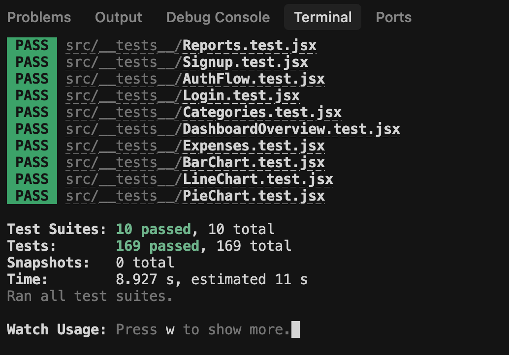
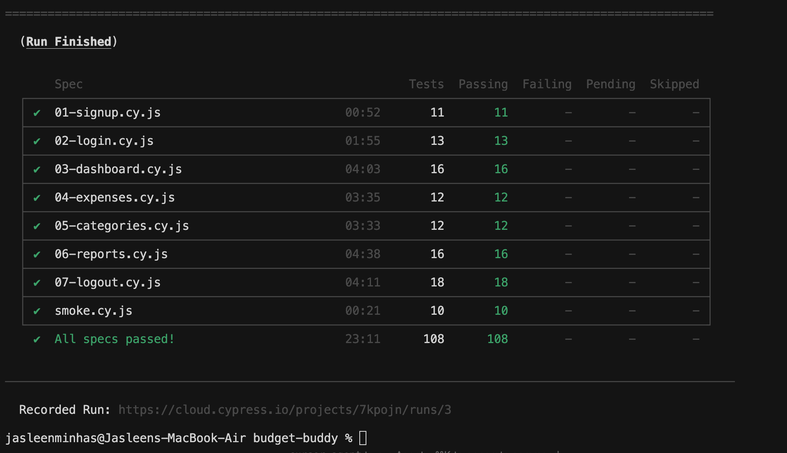

# 💸 Budget Buddy (Group 6)

**Budget Buddy** is a responsive personal finance tracker built as an academic project for the course **COMP6905 — Software Engineering**.  
The goal of this project is to apply **software engineering practices** (Agile, documentation, testing, CI/CD) while developing a full-stack web application.

- **Course**: COMP6905 — Software Engineering  
- **Purpose**: Academic use; demonstrates SE process from requirements → design → implementation → testing  
- **Tech Stack**: React, React Router, Chart.js, Firebase (Auth + Firestore), Jest, Cypress
- **Live Project**: https://budget-buddy-mun.vercel.app/

---

## 🚀 Project Overview

Budget Buddy is your **Budget Companion** — a free, easy-to-use web app for managing personal expenses.  
Unlike many market apps that become paid after trial, Budget Buddy focuses on **cost-effectiveness, accessibility, and simplicity**.  

**Core features: (Fall 2025 Scope)**
- Secure authentication (login/signup with Firebase)  
- Expense and category management  
- Data visualization with charts  
- Report generation (PDF export, CSV export)  
- Responsive design for desktop, tablet, and mobile  

**Extended scope: (In Future)**
- AI-driven insights (LLMs)  
- Notifications/reminders  
- Bill reminders

---

## 👥 Team

- **Group**: 6  

**Team Lead**  
- Jasleen Minhas — ID: 202481225 — jminhas@mun.ca  

**Team Members**  
- Sumaiya Khan — ID: 202480995 — sumaiyak@mun.ca  
- Kaustubh Patil — ID: 202580621 — kspatil@mun.ca  
- Joel George Sam — ID: 202483190 — jgeorgesam@mun.ca  
- Mashroor Rahman — ID: 202482239 — masroorr@mun.ca  
- Ronit Gajjar — ID: 202488048 — rhgajjar@mun.ca  

### 🛠️ Team Responsibilities 
- **Jasleen Minhas** — Project Lead / Full-Stack: Leads sprints, manages GitHub, authentication & security modules.  
- **Sumaiya Khan** — Frontend (UI/UX): Page layout and user-friendly interface design.  
- **Mashroor Rahman** — Backend/Database: Firestore structure, CRUD logic, and data validation.  
- **Kaustubh Patil** — Frontend (Expenses): Expense management UI and category integration.  
- **Joel George Sam** — QA/Testing: Test cases, automated/system testing, V&V compliance.  
- **Ronit Gajjar** — Reporting/Features: Charts, analytics, and PDF export module.  

---

## Methodology

We are following the **Agile Software Development** methodology, using an iterative sprint-based approach.  
- Work is divided into 5 sprints (2 weeks each), with clear milestones.  
- GitHub Projects, Issues, and Milestones are used for sprint planning and tracking.  
- Each feature is implemented incrementally, tested with unit/system tests, and refined based on feedback.  
- Continuous Integration (CI) is set up to ensure all commits are validated before merging. 
- Continous deployement (CD) is set up in vercel to insure non stop availabilty of the app. 
- Cypress tests are used E2E testing.
- Jest is used for Unit tesing of each functionality.

---

## 📅 Milestones / Iterations

### Iteration 1 (Sept 22 – Oct 5)
- Requirements gathering & analysis  
- User stories in GitHub (issues with story points, risk, priority)  
- UML diagrams (use case, sequence, class)  
- GitHub setup: repo, branch strategy, labels, milestones, issue templates  
- CI/CD setup (GitHub Actions)  
- Firebase project initialization  

**Deliverable:** Requirements documentation + repo setup  

---

### Iteration 2 (Oct 6 – Oct 19)
- React frontend setup (CRA, routing, context API)  
- Landing Page, Login, Signup  
- Authentication module with Firebase (login/signup/logout, session protection)  
- Unit tests for auth  

**Deliverable:** Working login/signup flow (deployed version)  

---

### Iteration 3 (Oct 20 – Nov 2)
- Expense management (Add/Edit/Delete/List)  
- Category management (create/manage categories)  
- Firestore integration with real-time sync  
- Unit tests for CRUD  

**Deliverable:** Functional expense + category management  

---

### Iteration 4 (Nov 3 – Nov 16)
- Visualization with Pie, Bar, Line charts  
- Reporting: export PDF summaries + charts  
- Dashboard with summary view  
- UI/UX responsiveness across devices  
- Usability testing  

**Deliverable:** Dashboard with analytics & reporting  

---

### Iteration 5 (Nov 17 – Nov 30)
- E2E Testing using Cypress
- System testing, bug fixing, performance optimization  
- Final documentation (report)  
- Presentation & demo prep  
- Repo finalization (issues closed, PRs merged, iteration tags added)  

**Deliverable:** Final working app + report + demo  

---

## 🏷️ Labels (Features)

We use GitHub **Labels** for tracking features and tasks:  

- 🔒 **Authentication** — Login/Signup & Firebase Auth  
- 💸 **Expense Management** — CRUD operations for expenses  
- 📂 **Category Management** — Organizing expense categories  
- 📊 **Visualisation using Charts** — Pie/Bar/Line charts  
- 🖥️ **Dashboard** — Central view of expenses & insights  
- 🔑 **Login** — User login flow  
- 📝 **Sign up** — User registration flow  
- 📑 **Report Generation** — PDF export of expenses  
- 📚 **Documentation** — Reports, diagrams, project docs  
- 🐞 **Bug Fixing** — Debugging & patching issues  
- 📱 **Responsive Design** — Cross-device support  
- 🔥 **Firebase/Database Setup** — Firestore structure, sync  
- ✅ **Unit Test** — Component/feature-level testing  
- 🧪 **E2E Test** — End-to-end testing  


---

## Technologies & Tools  

| **Technology / Tool**       | **Purpose**              | **Reason for Choice**                                                                 |
|------------------------------|--------------------------|----------------------------------------------------------------------------------------|
| **React.js**                | Frontend UI              | Popular, component-based, scalable, and supports responsive web design.                 |
| **React Context API** + **React Router** | State management & routing | Lightweight global state + SPA routing for auth-protected pages. |
| **Firebase Authentication** | User login/signup        | Secure, easy-to-integrate, with session handling built-in.                             |
| **Firebase Firestore**      | Database                 | Cloud-based, real-time NoSQL DB, ideal for expense data storage and synchronization.   |
| **Chart.js**                | Visualization            | Widely used, customizable, and integrates easily with React.                           |
| **date-fns**                | Date handling            | Lightweight and faster than Moment.js for parsing and formatting dates.                |
| **jsPDF + html2canvas**     | Report generation        | Allows exporting dashboard summaries into PDF easily.                                  |
| **Jest + React Testing Library** | Component testing   | Industry standard for reliable, maintainable unit & integration tests.                 |
| **Cypress**                  | E2E testing             | Real-browser coverage of signup/login, expenses, categories, reports, charts, logout. |
| **Node.js 20 + npm**         | Runtime/tooling         | Aligns with Cypress/Joi engine requirements and CI runners.                            |
| **Vercel and GitHub Actions**           | CI/CD                   | Automates builds, Jest coverage, Cypress suites, and artifact uploads.                 |
| **GitHub (Projects, Issues, PRs)** | Collaboration     | Central hub for Agile planning, documentation, and code reviews.                      |


---

## 🚀 How to Run the Project

### Prerequisites
- **Node.js** (version 20 LTS or newer — required by Cypress & Joi)
- **npm** (comes with Node.js)
- **Git** (for cloning the repository)

### Installation & Setup

1. **Clone the Repository**
   ```bash
   git clone https://github.com/JasleenMinhas578/BudgetBuddy.git
   cd BudgetBuddy
   ```

2. **Install Dependencies**
   ```bash
   npm install
   ```

3. **Environment Configuration**
   - ✅ **The `.env` file is already included in this private repository**
   - ✅ **Firebase configuration is pre-configured**
   - ✅ **No additional environment setup required**

4. **Start the Development Server**
   ```bash
   npm start
   ```

5. **Access the Application**
   - Open your browser and navigate to `http://localhost:3000`
   - The application will automatically reload when you make changes

### Available Scripts

```bash
# Start development server
npm start

# Run tests
npm test

# Run tests with coverage
npm test -- --coverage --watchAll=false

# Build for production
npm run build

# Run specific test file
npm test -- --testPathPattern=Categories.test.jsx
```

### Project Structure
```
budget-buddy/
├── public/                         # CRA public assets (index.html, icons, manifest)
├── src/
│   ├── components/
│   │   ├── Auth/                   # Login / Signup views
│   │   ├── Charts/                 # PieChart, BarChart, LineChart wrappers
│   │   ├── Dashboard/              # DashboardOverview, Reports, Categories, Expenses
│   │   ├── Expense/                # ExpenseForm, ExpenseList
│   │   ├── Layout/                 # Navbar, Sidebar, responsive shells
│   │   └── UI/                     # Modal, Toast, loaders, shared UI pieces
│   ├── context/                    # AuthContext provider
│   ├── services/                   # Firebase CRUD helpers (database.js)
│   ├── styles/                     # main.css, modal css, etc.
│   ├── __tests__/                  # Jest + RTL suites (AuthFlow, Reports, Charts…)
│   ├── firebaseConfig.js           # Firebase initialization
│   └── setupTests.js               # RTL/Jest bootstrap & mocks
├── cypress/
│   ├── e2e/                        # Cypress specs (01-signup … smoke)
│   ├── fixtures/                   # JSON fixtures for tests
│   ├── support/                    # commands.js, e2e.js
│   ├── screenshots/                # Auto-captured failure screenshots
│   └── videos/                     # Recorded runs (local + CI)
├── Documents/
│   ├── CI_e2e_run/                 # Cypress summaries, screenshots, reports
│   ├── Project_Progress_Files/     # PDFs & slides submitted for the course
│   ├── Project_Proposal_Files/     # Proposal docs/slides
│   └── UML/                        # Use case, sequence, class diagrams
├── build/                          # Production build artifacts (generated)
├── coverage/                       # Jest coverage reports
├── scripts/                        # Helper scripts / utilities
├── .github/workflows/              # CI/CD definitions (ci.yml, e2e.yml)
├── .env                            # Firebase env vars (private repo)
├── package.json / package-lock.json
└── README.md
```

### Firebase Configuration
- **Authentication**: Email/Password authentication enabled
- **Firestore**: Real-time database for expenses and categories

### Troubleshooting

**Common Issues:**
- **Port 3000 in use**: The app will automatically suggest using a different port
- **Dependencies issues**: Run `npm install` again
- **Firebase errors**: Ensure you have internet connection
- **Test failures**: Run `npm test -- --watchAll=false` to see detailed error messages

**Need Help?**
- Check the console for error messages
- Ensure all dependencies are installed: `npm install`
- Verify Node.js version: `node --version` (should be 16+)

---

## 🧪 Unit Test Cases Summary

Our comprehensive test suite ensures reliability and maintainability of the Budget Buddy application. We follow industry best practices with **Jest** and **React Testing Library** for unit testing.

### 📊 Test Coverage Overview
- **Total Test Files**: 10
- **Total Tests**: 169 tests
- **Overall Coverage**: 100%
- **Status**: All tests passing ✅


*Screenshot showing all tests passing*

### 🔬 Unit Test Cases Short Table Summary:

| Test Suite (file)          | # Tests | Key Focus Areas |
|----------------------------|:-------:|-----------------|
| **Categories.test.jsx**    | 26 | Modal open/close, CRUD workflows, validation, Firebase listeners, toast feedback, lifecycle edge cases. |
| **Login.test.jsx**         | 16 | Rendering/accessibility, field interactions, navigation, auth error states, validation, loading indicators. |
| **Signup.test.jsx**        | 23 | Password rules, visibility toggles, navigation, form validation, error handling, loading states. |
| **Expenses.test.jsx**      | 7  | List rendering, add-expense modal, summary cards, Firebase error handling. |
| **AuthFlow.test.jsx**      | 27 | End-to-end auth, session persistence, private routes, redirect logic. |
| **Reports.test.jsx**       | 27 | Summary metrics, charts, date filters, table empty states, PDF/CSV exports, error/loading states. |
| **DashboardOverview.test.jsx** | 16 | Welcome messaging, summary cards, recent expenses widget, Firestore integration, navigation links. |
| **BarChart.test.jsx**      | 10 | Chart wrapper rendering, data permutations (empty/single/multi/zero/negative), resilience with undefined props. |
| **LineChart.test.jsx**     | 9  | Trend chart rendering, dataset permutations, Chart.js registration sanity checks. |
| **PieChart.test.jsx**      | 8  | Category distribution rendering, multiple dataset permutations, Chart.js wiring smoke tests. |


### 🔬 Unite Test Files Breakdown 

#### **1. Categories.test.jsx** (26 tests)
**Component**: Categories management with charts and CRUD operations
- **Basic Rendering** (2 tests) - Component structure and UI elements
- **Modal Interactions** (3 tests) - Add category modal open/close functionality
- **Form Interactions** (3 tests) - Input handling and form validation
- **Category Addition** (4 tests) - CRUD operations and success feedback
- **Error Handling** (4 tests) - Firebase errors and edge cases
- **Firebase Integration** (3 tests) - Database operations and real-time sync
- **Data Loading** (2 tests) - Categories and expenses data fetching
- **Form Validation** (2 tests) - Input validation and requirements
- **Toast Notifications** (1 test) - User feedback system
- **Component Lifecycle** (2 tests) - Mount/unmount and re-render handling

#### **2. Login.test.jsx** (16 tests)
**Component**: User authentication login
- **Rendering** (3 tests) - UI elements and accessibility
- **Form Interactions** (2 tests) - Input field updates and loading states
- **Navigation** (3 tests) - Route changes and redirects
- **Error Handling** (4 tests) - Authentication error scenarios
- **Form Validation** (2 tests) - Input validation and submission
- **Loading States** (2 tests) - Button states and spinners

#### **3. Signup.test.jsx** (23 tests)
**Component**: User registration
- **Rendering** (3 tests) - UI elements and accessibility
- **Form Interactions** (4 tests) - Input handling and password visibility
- **Password Validation** (4 tests) - Password strength requirements
- **Navigation** (3 tests) - Route changes and redirects
- **Error Handling** (4 tests) - Registration error scenarios
- **Form Validation** (1 test) - Input validation and submission
- **Loading States** (2 tests) - Button states and spinners
- **Password Visibility Toggle** (2 tests) - UI interaction testing

#### **4. Expenses.test.jsx** (7 tests)
**Component**: Expense management and display
- **Basic Rendering** (3 tests) - Component structure and empty states
- **Add Expense** (2 tests) - Modal opening and form interaction
- **Error Handling** (1 test) - Firebase connection errors
- **Component Integration** (2 tests) - Summary statistics and data display

#### **5. AuthFlow.test.jsx** (27 tests)
**Component**: Complete authentication flow integration
- **End-to-End Authentication Flow** - Complete login/signup integration
- **User Session Management** - Authentication state handling
- **Route Protection** - Private route access control

#### **6. Reports.test.jsx** (27 tests)
**Component**: Analytics dashboard & export workflows
- **Rendering & Controls** (3 tests) - Header copy, export CTA, and date filter controls
- **Summary Metrics** (4 tests) - Total spend, transaction count, averages, top category card accuracy
- **Chart Rendering** (3 tests) - Pie and line charts render with expected datasets
- **Date Filtering** (6 tests) - All Time / Today / This Month / Custom range filtering logic
- **Table & Empty States** (5 tests) - Transaction list contents, pagination, and fallbacks when no data exists
- **Exports & Downloads** (4 tests) - PDF/CSV export buttons, jsPDF integration, and blob handling
- **Error Handling & Loading** (2 tests) - Firebase listener failures and loading skeletons
- **Filter Presets & Chips** (3 tests) - Category/tag filter toggles and reset behavior

#### **7. DashboardOverview.test.jsx** (16 tests)
**Component**: Landing dashboard summary cards & recent expenses widget
- **Welcome States** (2 tests) - First-time vs returning user messaging
- **Summary Cards** (5 tests) - Total, monthly, average spend, and top category calculations/empty state
- **Recent Expenses List** (4 tests) - Shows latest five entries, metadata formatting, and empty-state CTA
- **Firestore Integration** (3 tests) - Real-time snapshot wiring, unsubscribe handling, console noise suppression
- **Routing Hooks** (2 tests) - “View All” links and button targets

#### **8. BarChart.test.jsx** (10 tests)
**Component**: Bar chart wrapper for category/month comparisons
- **Chart Rendering** (3 tests) - Mounts, wrapper class presence, Chart.js registration sanity checks
- **Data Permutations** (5 tests) - Empty, single, multi, zero, and negative datasets
- **Resilience** (2 tests) - Works with undefined props and large data arrays

#### **9. LineChart.test.jsx** (9 tests)
**Component**: Line chart for monthly spending trends
- **Rendering & Styling** (2 tests) - Ensures chart + wrapper mount
- **Data Coverage** (5 tests) - Empty, single point, multi-month, zero, and undefined dataset handling
- **Chart.js Wiring** (2 tests) - Registration side effects and dataset serialization

#### **10. PieChart.test.jsx** (8 tests)
**Component**: Pie chart for category distribution
- **Rendering** (2 tests) - Chart + wrapper presence with default data
- **Data Variants** (4 tests) - Empty, single, multi-category, and undefined datasets
- **Chart.js Hooks** (2 tests) - Registration and serialization smoke tests

### 🛠️ Testing Strategy

#### **Mocking Strategy**
- **Firebase**: Complete mocking of Auth and Firestore services
- **Charts**: Mocked Chart.js components to prevent DOM errors
- **Animations**: Framer Motion components mocked for test stability
- **Navigation**: React Router mocked for route testing
- **UI Components**: Modal and Toast components mocked

#### **Test Quality Features**
- ✅ **Comprehensive Coverage**: Authentication, CRUD operations, UI interactions
- ✅ **Error Handling**: Firebase errors, validation errors, edge cases
- ✅ **Accessibility**: ARIA attributes and keyboard navigation testing
- ✅ **Loading States**: Button states, spinners, and async operations
- ✅ **Form Validation**: Input validation and submission testing
- ✅ **Component Lifecycle**: Mount/unmount and re-render testing

### 🎯 Testing Commands

```bash
# Run all tests
npm test

# Run tests with coverage
npm test -- --coverage --watchAll=false

# Run specific test file
npm test -- --testPathPattern=Categories.test.jsx

# Run tests in watch mode
npm test -- --watch
```

### 🔧 Test Configuration

Our test setup includes:
- **Jest** as the testing framework
- **React Testing Library** for component testing
- **@testing-library/jest-dom** for custom matchers
- **@testing-library/user-event** for user interaction simulation
- **jsdom** environment for DOM testing

---

## 🎭 E2E Testing with Cypress

Budget Buddy includes comprehensive end-to-end (E2E) testing using **Cypress** to ensure all critical user flows work correctly in a real browser environment.

### 📦 Cypress Setup

Cypress is already installed and configured in the project. The E2E tests verify:
- ✅ User signup and registration
- ✅ User login and authentication
- ✅ Dashboard display and navigation
- ✅ Adding and managing expenses
- ✅ Creating and managing categories
- ✅ Viewing charts and visualizations
- ✅ Generating and exporting reports
- ✅ User logout and session management

### 🚀 Running Cypress Tests

#### **Interactive Mode (Recommended for Development)**
Open Cypress Test Runner with a visual interface:

```bash
# Open Cypress in interactive mode
npm run cypress:open

# Or with the app already running
npm run test:e2e:dev
```

This will:
1. Open the Cypress Test Runner GUI
2. Allow you to select and run individual test files
3. Watch tests execute in a real browser
4. Enable debugging and step-through

#### **Headless Mode (For CI/CD)**
Run all tests in the terminal without GUI:

```bash
# Run all tests in headless mode
npm run cypress:run

# Run with specific browser
npm run cypress:run:chrome

# Run with visible browser (headed mode)
npm run cypress:run:headed

# Run with server start and tests
npm run test:e2e
```

#### **Run Specific Test File**
```bash
# Run a specific test file
npx cypress run --spec "cypress/e2e/01-signup.cy.js"

# Run tests matching a pattern
npx cypress run --spec "cypress/e2e/*-login.cy.js"
```

### 📁 Test File Structure

```
cypress/
├── e2e/
│   ├── smoke.cy.js           # Smoke tests for basic functionality
│   ├── 01-signup.cy.js        # User signup flow tests
│   ├── 02-login.cy.js         # User login flow tests
│   ├── 03-dashboard.cy.js     # Dashboard display tests
│   ├── 04-expenses.cy.js      # Add expense flow tests
│   ├── 05-categories.cy.js    # Add categories flow tests
│   ├── 06-reports.cy.js       # Export reports flow tests
│   └── 07-logout.cy.js        # User logout flow tests
├── fixtures/
│   ├── users.json            # Test user data
│   ├── expenses.json         # Test expense data
│   └── categories.json       # Test category data
├── support/
│   ├── commands.js           # Custom Cypress commands
│   └── e2e.js                # Global test configuration
├── screenshots/              # Auto-captured on test failure
└── videos/                   # Recorded test runs
```

### 🧪 Test Coverage Overview

| Test Suite | # Tests | Coverage |
|------------|---------|----------|
| **Smoke Tests** | 10 | Basic application functionality |
| **Signup Flow** | 11 | User registration and validation |
| **Login Flow** | 13 | Authentication and error handling |
| **Dashboard** | 16 | Navigation and data display |
| **Expenses** | 12 | CRUD operations for expenses |
| **Categories** | 12 | Category management |
| **Reports** | 16 | Report generation and export |
| **Logout** | 18 | Session management |
| **Total** | **108** | **Complete E2E coverage** |


### 🎯 Screenshot of E2E Test Cases


*Screenshot showing all tests passing*


*Screenshot showing all tests passing*


### 📊 Test Results Artifacts

After running tests, Cypress generates:

#### **Screenshots**
- Automatically captured on test failures
- Location: `cypress/screenshots/`
- Helps identify what went wrong

#### **Videos**
- Recorded for all test runs
- Location: `cypress/videos/`
- Complete playback of test execution

#### **Access Artifacts**
```bash
# View screenshots
open cypress/screenshots/

# View videos
open cypress/videos/
```

### 🔄 CI/CD Integration

Cypress tests run automatically on:
- Push to `main` or `develop` branches
- Pull requests to `main` or `develop`
- Manual workflow dispatch

#### **GitHub Actions Workflow**

The `.github/workflows/e2e.yml` workflow:
- Runs the Cypress suite on Node 20 across Chrome & Edge matrices
- Uploads screenshots/videos for failed specs along with summary artifacts
- Uses Firebase env secrets so the dev server behaves like local
- Emits job summaries + downloadable artifacts for every run

#### **E2E Coverage Snapshot**
- **Specs**: 8 primary flows (`01-signup` … `07-logout` + `smoke`)
- **User journeys covered**: auth (happy/error), dashboard navigation, expenses & categories CRUD, reports/charts export, logout, smoke verification.
- **Artifacts & Logs**:
  - Screenshots: `cypress/screenshots/<spec>/<test>.png`
  - Videos: `cypress/videos/<spec>.mp4`
  - Summary docs: `Documents/CI_e2e_run/CYPRESS_TEST_SUMMARY.md`, `Cypress_Readme.md`, `E2E_TESTING_COMPLETE.md`
  - GitHub Actions artifacts: `cypress-screenshots-*`, `cypress-videos-*`, `cypress-results-*`

#### **View Test Results in CI**
1. Go to the **Actions** tab in GitHub
2. Select the **E2E Tests with Cypress** workflow
3. Click on a specific run to see results
4. Download artifacts (screenshots/videos) if tests fail

### 🐛 Debugging Tests

#### **Debug in Interactive Mode**
```bash
npm run cypress:open
```
- Click on a test file to run it
- Use browser DevTools to inspect elements
- Add `cy.pause()` to pause test execution
- Use `cy.debug()` to log debug information

#### **Debug Failed Tests**
```bash
# Run failed tests with verbose output
npx cypress run --spec "cypress/e2e/failing-test.cy.js" --headed --no-exit
```

#### **Common Debug Commands**
```javascript
// Pause test execution
cy.pause();

// Print debug info
cy.debug();

// Take screenshot
cy.screenshot('debug-screenshot');

// Log to console
cy.log('Debug message');
```

### ⚙️ Cypress Configuration

Key configuration in `cypress.config.js`:

```javascript
{
  baseUrl: 'http://localhost:3000',
  viewportWidth: 1280,
  viewportHeight: 720,
  video: true,
  screenshotOnRunFailure: true,
  defaultCommandTimeout: 10000,
  retries: {
    runMode: 2,    // Retry failed tests in CI
    openMode: 0    // No retries in interactive mode
  }
}
```

### 📚 Cypress Resources

- **Official Docs**: https://docs.cypress.io
- **Best Practices**: https://docs.cypress.io/guides/references/best-practices
- **Examples**: https://example.cypress.io
- **API Reference**: https://docs.cypress.io/api/table-of-contents

## 📂 Deliverables
- Requirements and Design Documentation  
- UML diagrams (use case, class, sequence)  
- Functional web application (React + Firebase)  
- Unit tests & E22 tests  
- Final project Report  
- Presentation + Demo 
- Live Project: https://budget-buddy-mun.vercel.app/ 

---

## 📚 References
- GitHub Project Management Guide: https://guides.github.com/features/issues/  
- Firebase Documentation: https://firebase.google.com/docs  
- React Docs: https://react.dev/  
- Chart.js Docs: https://www.chartjs.org/docs/latest/  
- Agile User Stories: https://www.mountaingoatsoftware.com/agile/user-stories  

---
